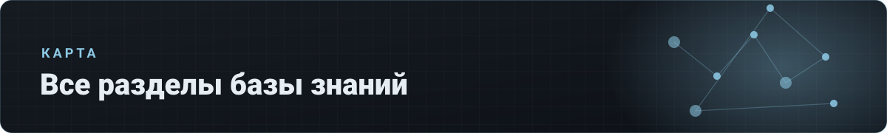

# 🗺 Карта разделов

[⌂ База знаний](README.md) · [🗺 Карта](MAP.md) · Индексы: [релизы](indexes/релизы.md) · [ошибки](indexes/ошибки.md) · [env](indexes/env.md) · [термины](indexes/термины.md) · [ссылки](indexes/ссылки.md)

> Все разделы всех документов на одной странице: для поиска глазами и через Ctrl+F.

---

## 🛠 [01. Панели](docs/01-панели/README.md)

Remnawave, Bedolaga-бот, Cabinet, admin-панели, миграции с Marzban и 3x-ui · `11 документов` · `3540 строк` · `2348 пруфов`

<b><a href="docs/01-панели/релизы.md">Релизы</a></b> — 14 разделов

- [Период 23.08–07.09.2025 — Bedolaga v2.0.x–2.2.x, Remnawave 2.1.x](docs/01-панели/релизы.md#период-230807092025--bedolaga-v20x22x-remnawave-21x)
- [Период 12.11.2025–01.01.2026 — Bedolaga v2.7–2.9.4, Remnawave 2.3–2.4](docs/01-панели/релизы.md#период-1211202501012026--bedolaga-v27294-remnawave-2324)
- [Период 09.02–13.03.2026 — Bedolaga v3.9–3.32, Remnawave 2.6.x, Remnawave-admin 2.x](docs/01-панели/релизы.md#период-090213032026--bedolaga-v39332-remnawave-26x-remnawave-admin-2x)
- [Период 16.03–06.04.2026 — Remnawave 2.7.x (breaking), Bedolaga v3.33–3.45](docs/01-панели/релизы.md#период-160306042026--remnawave-27x-breaking-bedolaga-v333345)
- [Период 06–25.04.2026 — Bedolaga v3.45–3.52, Remnawave-admin 2.9–2.11](docs/01-панели/релизы.md#период-0625042026--bedolaga-v345352-remnawave-admin-29211)
- [Период 25.04–15.05.2026 — Bedolaga v3.49–3.55, Cabinet 1.49–1.52](docs/01-панели/релизы.md#период-250415052026--bedolaga-v349355-cabinet-149152)
- [Период 16.05–05.06.2026 — Bedolaga v3.56–3.58, Remnawave-admin 2.14](docs/01-панели/релизы.md#период-160505062026--bedolaga-v356358-remnawave-admin-214)
- [Период 07–26.06.2026 — Bedolaga 3.60–3.61, Subscription-page 7.2.5/7.2.6](docs/01-панели/релизы.md#период-0726062026--bedolaga-360361-subscription-page-725726)
- [Период 26.06–08.07.2026 — Remnawave 2.8.0, Bedolaga v3.61–3.62, Cabinet 1.59](docs/01-панели/релизы.md#период-260608072026--remnawave-280-bedolaga-v361362-cabinet-159)
- [Период 08–20.07.2026 — Remnawave 2.8.1, Bedolaga v3.62–3.64, Cabinet 1.61](docs/01-панели/релизы.md#период-0820072026--remnawave-281-bedolaga-v362364-cabinet-161)
- [Период 20–31.07.2026 — Bedolaga v3.66/3.67 + Cabinet 1.64 (рекурренты Platega/Lava)](docs/01-панели/релизы.md#период-2031072026--bedolaga-v366367--cabinet-164-рекурренты-plategalava)
- [Период 31.07–09.08.2026 — Remnawave 3.0.0 (ломающий), Bedolaga v4.0.0, Cabinet 1.65](docs/01-панели/релизы.md#период-310709082026--remnawave-300-ломающий-bedolaga-v400-cabinet-165)
- [Период 09–20.08.2026 — Remnawave 3.2.3/3.3.0, Bedolaga v4.1.0 (GeoCheck)](docs/01-панели/релизы.md#период-0920082026--remnawave-323330-bedolaga-v410-geocheck)
- [Период 20–23.08.2026 — совместимость 2.8.x/3.2.2, GHCR, пин-борда](docs/01-панели/релизы.md#период-2023082026--совместимость-28x322-ghcr-пин-борда)

<b><a href="docs/01-панели/установка-обновление.md">Установка и обновление</a></b> — 14 разделов

- [Период 23.08–07.09.2025 — Bedolaga v2.0.x–2.2.x, Remnawave 2.1.x](docs/01-панели/установка-обновление.md#период-230807092025--bedolaga-v20x22x-remnawave-21x)
- [Период 12.11.2025–01.01.2026 — Bedolaga v2.7–2.9.4, Remnawave 2.3–2.4](docs/01-панели/установка-обновление.md#период-1211202501012026--bedolaga-v27294-remnawave-2324)
- [Период 09.02–13.03.2026 — Bedolaga v3.9–3.32, Remnawave 2.6.x, Remnawave-admin 2.x](docs/01-панели/установка-обновление.md#период-090213032026--bedolaga-v39332-remnawave-26x-remnawave-admin-2x)
- [Период 16.03–06.04.2026 — Remnawave 2.7.x (breaking), Bedolaga v3.33–3.45](docs/01-панели/установка-обновление.md#период-160306042026--remnawave-27x-breaking-bedolaga-v333345)
- [Период 06–25.04.2026 — Bedolaga v3.45–3.52, Remnawave-admin 2.9–2.11](docs/01-панели/установка-обновление.md#период-0625042026--bedolaga-v345352-remnawave-admin-29211)
- [Период 25.04–15.05.2026 — Bedolaga v3.49–3.55, Cabinet 1.49–1.52](docs/01-панели/установка-обновление.md#период-250415052026--bedolaga-v349355-cabinet-149152)
- [Период 16.05–05.06.2026 — Bedolaga v3.56–3.58, Remnawave-admin 2.14](docs/01-панели/установка-обновление.md#период-160505062026--bedolaga-v356358-remnawave-admin-214)
- [Период 07–26.06.2026 — Bedolaga 3.60–3.61, Subscription-page 7.2.5/7.2.6](docs/01-панели/установка-обновление.md#период-0726062026--bedolaga-360361-subscription-page-725726)
- [Период 26.06–08.07.2026 — Remnawave 2.8.0, Bedolaga v3.61–3.62, Cabinet 1.59](docs/01-панели/установка-обновление.md#период-260608072026--remnawave-280-bedolaga-v361362-cabinet-159)
- [Период 08–20.07.2026 — Remnawave 2.8.1, Bedolaga v3.62–3.64, Cabinet 1.61](docs/01-панели/установка-обновление.md#период-0820072026--remnawave-281-bedolaga-v362364-cabinet-161)
- [Период 20–31.07.2026 — Bedolaga v3.66/3.67 + Cabinet 1.64 (рекурренты Platega/Lava)](docs/01-панели/установка-обновление.md#период-2031072026--bedolaga-v366367--cabinet-164-рекурренты-plategalava)
- [Период 31.07–09.08.2026 — Remnawave 3.0.0 (ломающий), Bedolaga v4.0.0, Cabinet 1.65](docs/01-панели/установка-обновление.md#период-310709082026--remnawave-300-ломающий-bedolaga-v400-cabinet-165)
- [Период 09–20.08.2026 — Remnawave 3.2.3/3.3.0, Bedolaga v4.1.0 (GeoCheck)](docs/01-панели/установка-обновление.md#период-0920082026--remnawave-323330-bedolaga-v410-geocheck)
- [Период 20–23.08.2026 — совместимость 2.8.x/3.2.2, GHCR, пин-борда](docs/01-панели/установка-обновление.md#период-2023082026--совместимость-28x322-ghcr-пин-борда)

<b><a href="docs/01-панели/docker-compose.md">Docker-compose</a></b> — 14 разделов

- [Период 23.08–07.09.2025 — Bedolaga v2.0.x–2.2.x, Remnawave 2.1.x](docs/01-панели/docker-compose.md#период-230807092025--bedolaga-v20x22x-remnawave-21x)
- [Период 12.11.2025–01.01.2026 — Bedolaga v2.7–2.9.4, Remnawave 2.3–2.4](docs/01-панели/docker-compose.md#период-1211202501012026--bedolaga-v27294-remnawave-2324)
- [Период 09.02–13.03.2026 — Bedolaga v3.9–3.32, Remnawave 2.6.x, Remnawave-admin 2.x](docs/01-панели/docker-compose.md#период-090213032026--bedolaga-v39332-remnawave-26x-remnawave-admin-2x)
- [Период 16.03–06.04.2026 — Remnawave 2.7.x (breaking), Bedolaga v3.33–3.45](docs/01-панели/docker-compose.md#период-160306042026--remnawave-27x-breaking-bedolaga-v333345)
- [Период 06–25.04.2026 — Bedolaga v3.45–3.52, Remnawave-admin 2.9–2.11](docs/01-панели/docker-compose.md#период-0625042026--bedolaga-v345352-remnawave-admin-29211)
- [Период 25.04–15.05.2026 — Bedolaga v3.49–3.55, Cabinet 1.49–1.52](docs/01-панели/docker-compose.md#период-250415052026--bedolaga-v349355-cabinet-149152)
- [Период 16.05–05.06.2026 — Bedolaga v3.56–3.58, Remnawave-admin 2.14](docs/01-панели/docker-compose.md#период-160505062026--bedolaga-v356358-remnawave-admin-214)
- [Период 07–26.06.2026 — Bedolaga 3.60–3.61, Subscription-page 7.2.5/7.2.6](docs/01-панели/docker-compose.md#период-0726062026--bedolaga-360361-subscription-page-725726)
- [Период 26.06–08.07.2026 — Remnawave 2.8.0, Bedolaga v3.61–3.62, Cabinet 1.59](docs/01-панели/docker-compose.md#период-260608072026--remnawave-280-bedolaga-v361362-cabinet-159)
- [Период 08–20.07.2026 — Remnawave 2.8.1, Bedolaga v3.62–3.64, Cabinet 1.61](docs/01-панели/docker-compose.md#период-0820072026--remnawave-281-bedolaga-v362364-cabinet-161)
- [Период 20–31.07.2026 — Bedolaga v3.66/3.67 + Cabinet 1.64 (рекурренты Platega/Lava)](docs/01-панели/docker-compose.md#период-2031072026--bedolaga-v366367--cabinet-164-рекурренты-plategalava)
- [Период 31.07–09.08.2026 — Remnawave 3.0.0 (ломающий), Bedolaga v4.0.0, Cabinet 1.65](docs/01-панели/docker-compose.md#период-310709082026--remnawave-300-ломающий-bedolaga-v400-cabinet-165)
- [Период 09–20.08.2026 — Remnawave 3.2.3/3.3.0, Bedolaga v4.1.0 (GeoCheck)](docs/01-панели/docker-compose.md#период-0920082026--remnawave-323330-bedolaga-v410-geocheck)
- [Период 20–23.08.2026 — совместимость 2.8.x/3.2.2, GHCR, пин-борда](docs/01-панели/docker-compose.md#период-2023082026--совместимость-28x322-ghcr-пин-борда)

<b><a href="docs/01-панели/env.md">Env-переменные</a></b> — 14 разделов

- [Период 23.08–07.09.2025 — Bedolaga v2.0.x–2.2.x, Remnawave 2.1.x](docs/01-панели/env.md#период-230807092025--bedolaga-v20x22x-remnawave-21x)
- [Период 12.11.2025–01.01.2026 — Bedolaga v2.7–2.9.4, Remnawave 2.3–2.4](docs/01-панели/env.md#период-1211202501012026--bedolaga-v27294-remnawave-2324)
- [Период 09.02–13.03.2026 — Bedolaga v3.9–3.32, Remnawave 2.6.x, Remnawave-admin 2.x](docs/01-панели/env.md#период-090213032026--bedolaga-v39332-remnawave-26x-remnawave-admin-2x)
- [Период 16.03–06.04.2026 — Remnawave 2.7.x (breaking), Bedolaga v3.33–3.45](docs/01-панели/env.md#период-160306042026--remnawave-27x-breaking-bedolaga-v333345)
- [Период 06–25.04.2026 — Bedolaga v3.45–3.52, Remnawave-admin 2.9–2.11](docs/01-панели/env.md#период-0625042026--bedolaga-v345352-remnawave-admin-29211)
- [Период 25.04–15.05.2026 — Bedolaga v3.49–3.55, Cabinet 1.49–1.52](docs/01-панели/env.md#период-250415052026--bedolaga-v349355-cabinet-149152)
- [Период 16.05–05.06.2026 — Bedolaga v3.56–3.58, Remnawave-admin 2.14](docs/01-панели/env.md#период-160505062026--bedolaga-v356358-remnawave-admin-214)
- [Период 07–26.06.2026 — Bedolaga 3.60–3.61, Subscription-page 7.2.5/7.2.6](docs/01-панели/env.md#период-0726062026--bedolaga-360361-subscription-page-725726)
- [Период 26.06–08.07.2026 — Remnawave 2.8.0, Bedolaga v3.61–3.62, Cabinet 1.59](docs/01-панели/env.md#период-260608072026--remnawave-280-bedolaga-v361362-cabinet-159)
- [Период 08–20.07.2026 — Remnawave 2.8.1, Bedolaga v3.62–3.64, Cabinet 1.61](docs/01-панели/env.md#период-0820072026--remnawave-281-bedolaga-v362364-cabinet-161)
- [Период 20–31.07.2026 — Bedolaga v3.66/3.67 + Cabinet 1.64 (рекурренты Platega/Lava)](docs/01-панели/env.md#период-2031072026--bedolaga-v366367--cabinet-164-рекурренты-plategalava)
- [Период 31.07–09.08.2026 — Remnawave 3.0.0 (ломающий), Bedolaga v4.0.0, Cabinet 1.65](docs/01-панели/env.md#период-310709082026--remnawave-300-ломающий-bedolaga-v400-cabinet-165)
- [Период 09–20.08.2026 — Remnawave 3.2.3/3.3.0, Bedolaga v4.1.0 (GeoCheck)](docs/01-панели/env.md#период-0920082026--remnawave-323330-bedolaga-v410-geocheck)
- [Период 20–23.08.2026 — совместимость 2.8.x/3.2.2, GHCR, пин-борда](docs/01-панели/env.md#период-2023082026--совместимость-28x322-ghcr-пин-борда)

<b><a href="docs/01-панели/reverse-proxy.md">Nginx / Caddy</a></b> — 2 разделов

- [Период 09.02–13.03.2026 — Bedolaga v3.9–3.32, Remnawave 2.6.x, Remnawave-admin 2.x](docs/01-панели/reverse-proxy.md#период-090213032026--bedolaga-v39332-remnawave-26x-remnawave-admin-2x)
- [Период 16.03–06.04.2026 — Remnawave 2.7.x (breaking), Bedolaga v3.33–3.45](docs/01-панели/reverse-proxy.md#период-160306042026--remnawave-27x-breaking-bedolaga-v333345)

<b><a href="docs/01-панели/конфиги-настройки.md">Конфиги и настройки</a></b> — 1 разделов

- [Период 31.07–09.08.2026 — Remnawave 3.0.0 (ломающий), Bedolaga v4.0.0, Cabinet 1.65](docs/01-панели/конфиги-настройки.md#период-310709082026--remnawave-300-ломающий-bedolaga-v400-cabinet-165)

<b><a href="docs/01-панели/ошибки-фиксы.md">Ошибки → фиксы</a></b> — 14 разделов

- [Период 23.08–07.09.2025 — Bedolaga v2.0.x–2.2.x, Remnawave 2.1.x](docs/01-панели/ошибки-фиксы.md#период-230807092025--bedolaga-v20x22x-remnawave-21x)
- [Период 12.11.2025–01.01.2026 — Bedolaga v2.7–2.9.4, Remnawave 2.3–2.4](docs/01-панели/ошибки-фиксы.md#период-1211202501012026--bedolaga-v27294-remnawave-2324)
- [Период 09.02–13.03.2026 — Bedolaga v3.9–3.32, Remnawave 2.6.x, Remnawave-admin 2.x](docs/01-панели/ошибки-фиксы.md#период-090213032026--bedolaga-v39332-remnawave-26x-remnawave-admin-2x)
- [Период 16.03–06.04.2026 — Remnawave 2.7.x (breaking), Bedolaga v3.33–3.45](docs/01-панели/ошибки-фиксы.md#период-160306042026--remnawave-27x-breaking-bedolaga-v333345)
- [Период 06–25.04.2026 — Bedolaga v3.45–3.52, Remnawave-admin 2.9–2.11](docs/01-панели/ошибки-фиксы.md#период-0625042026--bedolaga-v345352-remnawave-admin-29211)
- [Период 25.04–15.05.2026 — Bedolaga v3.49–3.55, Cabinet 1.49–1.52](docs/01-панели/ошибки-фиксы.md#период-250415052026--bedolaga-v349355-cabinet-149152)
- [Период 16.05–05.06.2026 — Bedolaga v3.56–3.58, Remnawave-admin 2.14](docs/01-панели/ошибки-фиксы.md#период-160505062026--bedolaga-v356358-remnawave-admin-214)
- [Период 07–26.06.2026 — Bedolaga 3.60–3.61, Subscription-page 7.2.5/7.2.6](docs/01-панели/ошибки-фиксы.md#период-0726062026--bedolaga-360361-subscription-page-725726)
- [Период 26.06–08.07.2026 — Remnawave 2.8.0, Bedolaga v3.61–3.62, Cabinet 1.59](docs/01-панели/ошибки-фиксы.md#период-260608072026--remnawave-280-bedolaga-v361362-cabinet-159)
- [Период 08–20.07.2026 — Remnawave 2.8.1, Bedolaga v3.62–3.64, Cabinet 1.61](docs/01-панели/ошибки-фиксы.md#период-0820072026--remnawave-281-bedolaga-v362364-cabinet-161)
- [Период 20–31.07.2026 — Bedolaga v3.66/3.67 + Cabinet 1.64 (рекурренты Platega/Lava)](docs/01-панели/ошибки-фиксы.md#период-2031072026--bedolaga-v366367--cabinet-164-рекурренты-plategalava)
- [Период 31.07–09.08.2026 — Remnawave 3.0.0 (ломающий), Bedolaga v4.0.0, Cabinet 1.65](docs/01-панели/ошибки-фиксы.md#период-310709082026--remnawave-300-ломающий-bedolaga-v400-cabinet-165)
- [Период 09–20.08.2026 — Remnawave 3.2.3/3.3.0, Bedolaga v4.1.0 (GeoCheck)](docs/01-панели/ошибки-фиксы.md#период-0920082026--remnawave-323330-bedolaga-v410-geocheck)
- [Период 20–23.08.2026 — совместимость 2.8.x/3.2.2, GHCR, пин-борда](docs/01-панели/ошибки-фиксы.md#период-2023082026--совместимость-28x322-ghcr-пин-борда)

<b><a href="docs/01-панели/admin-панели.md">Admin-панели</a></b> — 14 разделов

- [Период 23.08–07.09.2025 — Bedolaga v2.0.x–2.2.x, Remnawave 2.1.x](docs/01-панели/admin-панели.md#период-230807092025--bedolaga-v20x22x-remnawave-21x)
- [Период 12.11.2025–01.01.2026 — Bedolaga v2.7–2.9.4, Remnawave 2.3–2.4](docs/01-панели/admin-панели.md#период-1211202501012026--bedolaga-v27294-remnawave-2324)
- [Период 09.02–13.03.2026 — Bedolaga v3.9–3.32, Remnawave 2.6.x, Remnawave-admin 2.x](docs/01-панели/admin-панели.md#период-090213032026--bedolaga-v39332-remnawave-26x-remnawave-admin-2x)
- [Период 16.03–06.04.2026 — Remnawave 2.7.x (breaking), Bedolaga v3.33–3.45](docs/01-панели/admin-панели.md#период-160306042026--remnawave-27x-breaking-bedolaga-v333345)
- [Период 06–25.04.2026 — Bedolaga v3.45–3.52, Remnawave-admin 2.9–2.11](docs/01-панели/admin-панели.md#период-0625042026--bedolaga-v345352-remnawave-admin-29211)
- [Период 25.04–15.05.2026 — Bedolaga v3.49–3.55, Cabinet 1.49–1.52](docs/01-панели/admin-панели.md#период-250415052026--bedolaga-v349355-cabinet-149152)
- [Период 16.05–05.06.2026 — Bedolaga v3.56–3.58, Remnawave-admin 2.14](docs/01-панели/admin-панели.md#период-160505062026--bedolaga-v356358-remnawave-admin-214)
- [Период 07–26.06.2026 — Bedolaga 3.60–3.61, Subscription-page 7.2.5/7.2.6](docs/01-панели/admin-панели.md#период-0726062026--bedolaga-360361-subscription-page-725726)
- [Период 26.06–08.07.2026 — Remnawave 2.8.0, Bedolaga v3.61–3.62, Cabinet 1.59](docs/01-панели/admin-панели.md#период-260608072026--remnawave-280-bedolaga-v361362-cabinet-159)
- [Период 08–20.07.2026 — Remnawave 2.8.1, Bedolaga v3.62–3.64, Cabinet 1.61](docs/01-панели/admin-панели.md#период-0820072026--remnawave-281-bedolaga-v362364-cabinet-161)
- [Период 20–31.07.2026 — Bedolaga v3.66/3.67 + Cabinet 1.64 (рекурренты Platega/Lava)](docs/01-панели/admin-панели.md#период-2031072026--bedolaga-v366367--cabinet-164-рекурренты-plategalava)
- [Период 31.07–09.08.2026 — Remnawave 3.0.0 (ломающий), Bedolaga v4.0.0, Cabinet 1.65](docs/01-панели/admin-панели.md#период-310709082026--remnawave-300-ломающий-bedolaga-v400-cabinet-165)
- [Период 09–20.08.2026 — Remnawave 3.2.3/3.3.0, Bedolaga v4.1.0 (GeoCheck)](docs/01-панели/admin-панели.md#период-0920082026--remnawave-323330-bedolaga-v410-geocheck)
- [Период 20–23.08.2026 — совместимость 2.8.x/3.2.2, GHCR, пин-борда](docs/01-панели/admin-панели.md#период-2023082026--совместимость-28x322-ghcr-пин-борда)

<b><a href="docs/01-панели/кейсы.md">Кейсы и разборы</a></b> — 1 разделов

- [Период 09–20.08.2026 — Remnawave 3.2.3/3.3.0, Bedolaga v4.1.0 (GeoCheck)](docs/01-панели/кейсы.md#период-0920082026--remnawave-323330-bedolaga-v410-geocheck)

<b><a href="docs/01-панели/marzban-3x-ui.md">Marzban и 3x-ui</a></b> — 14 разделов

- [Период 23.08–07.09.2025 — Bedolaga v2.0.x–2.2.x, Remnawave 2.1.x](docs/01-панели/marzban-3x-ui.md#период-230807092025--bedolaga-v20x22x-remnawave-21x)
- [Период 12.11.2025–01.01.2026 — Bedolaga v2.7–2.9.4, Remnawave 2.3–2.4](docs/01-панели/marzban-3x-ui.md#период-1211202501012026--bedolaga-v27294-remnawave-2324)
- [Период 09.02–13.03.2026 — Bedolaga v3.9–3.32, Remnawave 2.6.x, Remnawave-admin 2.x](docs/01-панели/marzban-3x-ui.md#период-090213032026--bedolaga-v39332-remnawave-26x-remnawave-admin-2x)
- [Период 16.03–06.04.2026 — Remnawave 2.7.x (breaking), Bedolaga v3.33–3.45](docs/01-панели/marzban-3x-ui.md#период-160306042026--remnawave-27x-breaking-bedolaga-v333345)
- [Период 06–25.04.2026 — Bedolaga v3.45–3.52, Remnawave-admin 2.9–2.11](docs/01-панели/marzban-3x-ui.md#период-0625042026--bedolaga-v345352-remnawave-admin-29211)
- [Период 25.04–15.05.2026 — Bedolaga v3.49–3.55, Cabinet 1.49–1.52](docs/01-панели/marzban-3x-ui.md#период-250415052026--bedolaga-v349355-cabinet-149152)
- [Период 16.05–05.06.2026 — Bedolaga v3.56–3.58, Remnawave-admin 2.14](docs/01-панели/marzban-3x-ui.md#период-160505062026--bedolaga-v356358-remnawave-admin-214)
- [Период 07–26.06.2026 — Bedolaga 3.60–3.61, Subscription-page 7.2.5/7.2.6](docs/01-панели/marzban-3x-ui.md#период-0726062026--bedolaga-360361-subscription-page-725726)
- [Период 26.06–08.07.2026 — Remnawave 2.8.0, Bedolaga v3.61–3.62, Cabinet 1.59](docs/01-панели/marzban-3x-ui.md#период-260608072026--remnawave-280-bedolaga-v361362-cabinet-159)
- [Период 08–20.07.2026 — Remnawave 2.8.1, Bedolaga v3.62–3.64, Cabinet 1.61](docs/01-панели/marzban-3x-ui.md#период-0820072026--remnawave-281-bedolaga-v362364-cabinet-161)
- [Период 20–31.07.2026 — Bedolaga v3.66/3.67 + Cabinet 1.64 (рекурренты Platega/Lava)](docs/01-панели/marzban-3x-ui.md#период-2031072026--bedolaga-v366367--cabinet-164-рекурренты-plategalava)
- [Период 31.07–09.08.2026 — Remnawave 3.0.0 (ломающий), Bedolaga v4.0.0, Cabinet 1.65](docs/01-панели/marzban-3x-ui.md#период-310709082026--remnawave-300-ломающий-bedolaga-v400-cabinet-165)
- [Период 09–20.08.2026 — Remnawave 3.2.3/3.3.0, Bedolaga v4.1.0 (GeoCheck)](docs/01-панели/marzban-3x-ui.md#период-0920082026--remnawave-323330-bedolaga-v410-geocheck)
- [Период 20–23.08.2026 — совместимость 2.8.x/3.2.2, GHCR, пин-борда](docs/01-панели/marzban-3x-ui.md#период-2023082026--совместимость-28x322-ghcr-пин-борда)

<b><a href="docs/01-панели/ссылки-инструменты.md">Ссылки и инструменты</a></b> — 14 разделов

- [Период 23.08–07.09.2025 — Bedolaga v2.0.x–2.2.x, Remnawave 2.1.x](docs/01-панели/ссылки-инструменты.md#период-230807092025--bedolaga-v20x22x-remnawave-21x)
- [Период 12.11.2025–01.01.2026 — Bedolaga v2.7–2.9.4, Remnawave 2.3–2.4](docs/01-панели/ссылки-инструменты.md#период-1211202501012026--bedolaga-v27294-remnawave-2324)
- [Период 09.02–13.03.2026 — Bedolaga v3.9–3.32, Remnawave 2.6.x, Remnawave-admin 2.x](docs/01-панели/ссылки-инструменты.md#период-090213032026--bedolaga-v39332-remnawave-26x-remnawave-admin-2x)
- [Период 16.03–06.04.2026 — Remnawave 2.7.x (breaking), Bedolaga v3.33–3.45](docs/01-панели/ссылки-инструменты.md#период-160306042026--remnawave-27x-breaking-bedolaga-v333345)
- [Период 06–25.04.2026 — Bedolaga v3.45–3.52, Remnawave-admin 2.9–2.11](docs/01-панели/ссылки-инструменты.md#период-0625042026--bedolaga-v345352-remnawave-admin-29211)
- [Период 25.04–15.05.2026 — Bedolaga v3.49–3.55, Cabinet 1.49–1.52](docs/01-панели/ссылки-инструменты.md#период-250415052026--bedolaga-v349355-cabinet-149152)
- [Период 16.05–05.06.2026 — Bedolaga v3.56–3.58, Remnawave-admin 2.14](docs/01-панели/ссылки-инструменты.md#период-160505062026--bedolaga-v356358-remnawave-admin-214)
- [Период 07–26.06.2026 — Bedolaga 3.60–3.61, Subscription-page 7.2.5/7.2.6](docs/01-панели/ссылки-инструменты.md#период-0726062026--bedolaga-360361-subscription-page-725726)
- [Период 26.06–08.07.2026 — Remnawave 2.8.0, Bedolaga v3.61–3.62, Cabinet 1.59](docs/01-панели/ссылки-инструменты.md#период-260608072026--remnawave-280-bedolaga-v361362-cabinet-159)
- [Период 08–20.07.2026 — Remnawave 2.8.1, Bedolaga v3.62–3.64, Cabinet 1.61](docs/01-панели/ссылки-инструменты.md#период-0820072026--remnawave-281-bedolaga-v362364-cabinet-161)
- [Период 20–31.07.2026 — Bedolaga v3.66/3.67 + Cabinet 1.64 (рекурренты Platega/Lava)](docs/01-панели/ссылки-инструменты.md#период-2031072026--bedolaga-v366367--cabinet-164-рекурренты-plategalava)
- [Период 31.07–09.08.2026 — Remnawave 3.0.0 (ломающий), Bedolaga v4.0.0, Cabinet 1.65](docs/01-панели/ссылки-инструменты.md#период-310709082026--remnawave-300-ломающий-bedolaga-v400-cabinet-165)
- [Период 09–20.08.2026 — Remnawave 3.2.3/3.3.0, Bedolaga v4.1.0 (GeoCheck)](docs/01-панели/ссылки-инструменты.md#период-0920082026--remnawave-323330-bedolaga-v410-geocheck)
- [Период 20–23.08.2026 — совместимость 2.8.x/3.2.2, GHCR, пин-борда](docs/01-панели/ссылки-инструменты.md#период-2023082026--совместимость-28x322-ghcr-пин-борда)

## 🔌 [02. Транспорты](docs/02-транспорты/README.md)

Xray-конфиги дословно: Reality, XHTTP, gRPC, WS, Hysteria2, Trojan, SS-2022, клиенты · `15 документов` · `283 строк` · `165 пруфов`

<b><a href="docs/02-транспорты/клиенты.md">Клиенты</a></b> — 4 разделов

- [Happ](docs/02-транспорты/клиенты.md#happ)
- [INCY](docs/02-транспорты/клиенты.md#incy)
- [Throne](docs/02-транспорты/клиенты.md#throne)
- [mihomo / sing-box / прочие](docs/02-транспорты/клиенты.md#mihomo--sing-box--прочие)

[VLESS + Reality](docs/02-транспорты/reality.md) · [XHTTP](docs/02-транспорты/xhttp.md) · [Selfsteal](docs/02-транспорты/selfsteal.md) · [SNI и fingerprint](docs/02-транспорты/sni-fingerprint.md) · [gRPC](docs/02-транспорты/grpc.md) · [WebSocket + TLS](docs/02-транспорты/websocket.md) · [Hysteria2](docs/02-транспорты/hysteria2.md) · [Trojan](docs/02-транспорты/trojan.md) · [Shadowsocks / SS-2022](docs/02-транспорты/shadowsocks.md) · [Мультитранспорт и порты](docs/02-транспорты/мультитранспорт-порты.md) · [Роутинг](docs/02-транспорты/роутинг.md) · [Балансеры](docs/02-транспорты/балансеры.md) · [Ошибки → фиксы](docs/02-транспорты/ошибки-фиксы.md) · [Вехи](docs/02-транспорты/вехи.md)

## 🛡 [03. Обход ТСПУ](docs/03-обход-тспу/README.md)

Блокировки по датам, ТСПУ-механика, CDN-фронтинг, БС-подсети, мосты, детект · `13 документов` · `501 строк` · `335 пруфов`

<b><a href="docs/03-обход-тспу/хронология.md">Хронология блокировок</a></b> — 3 разделов

- [Хронология блокировок и вехи (с датами) · Часть A](docs/03-обход-тспу/хронология.md#хронология-блокировок-и-вехи-с-датами--часть-a)
- [Хронология вех (продолжение) · Часть B](docs/03-обход-тспу/хронология.md#хронология-вех-продолжение--часть-b)
- [События (12.08-23.08.2026) · Часть B](docs/03-обход-тспу/хронология.md#события-1208-23082026--часть-b)

<b><a href="docs/03-обход-тспу/методы-обхода.md">Работающие методы</a></b> — 3 разделов

- [Устойчивые методы (селфстил, обфускация, SNI) · Часть A](docs/03-обход-тспу/методы-обхода.md#устойчивые-методы-селфстил-обфускация-sni--часть-a)
- [Обходы (новое 06.2026+) · Часть B](docs/03-обход-тспу/методы-обхода.md#обходы-новое-062026--часть-b)
- [Finalmask-транспорты (SSH/DNS/Minecraft/XMC) — август 2026 · Часть B](docs/03-обход-тспу/методы-обхода.md#finalmask-транспорты-sshdnsminecraftxmc--август-2026--часть-b)

<b><a href="docs/03-обход-тспу/cdn-фронтинг.md">CDN-фронтинг</a></b> — 2 разделов

- [CDN-фронтинг (Yandex / Beeline / VK / Selectel / MWS) · Часть A](docs/03-обход-тспу/cdn-фронтинг.md#cdn-фронтинг-yandex--beeline--vk--selectel--mws--часть-a)
- [CDN-фронтинг по операторам (конкретика) · Часть B](docs/03-обход-тспу/cdn-фронтинг.md#cdn-фронтинг-по-операторам-конкретика--часть-b)

<b><a href="docs/03-обход-тспу/бс-подсети.md">БС (белые списки)</a></b> — 3 разделов

- [БС (белые списки) — механика и подсети · Часть A](docs/03-обход-тспу/бс-подсети.md#бс-белые-списки--механика-и-подсети--часть-a)
- [БС-механика (обновление 06.2026 — 08.2026) · Часть B](docs/03-обход-тспу/бс-подсети.md#бс-механика-обновление-062026--082026--часть-b)
- [Селектел / подсети на продажу (рынок 07-08.2026) · Часть B](docs/03-обход-тспу/бс-подсети.md#селектел--подсети-на-продажу-рынок-07-082026--часть-b)

<b><a href="docs/03-обход-тспу/мосты.md">Мосты RU→EU</a></b> — 2 разделов

- [Мосты (ru→eu) и каскады · Часть A](docs/03-обход-тспу/мосты.md#мосты-rueu-и-каскады--часть-a)
- [Мосты ru→eu (продолжение) · Часть B](docs/03-обход-тспу/мосты.md#мосты-rueu-продолжение--часть-b)

<b><a href="docs/03-обход-тспу/warp.md">WARP и Cloudflare</a></b> — 2 разделов

- [WARP / Cloudflare / NaiveProxy · Часть A](docs/03-обход-тспу/warp.md#warp--cloudflare--naiveproxy--часть-a)
- [WARP (продолжение) · Часть B](docs/03-обход-тспу/warp.md#warp-продолжение--часть-b)

<b><a href="docs/03-обход-тспу/детект-fingerprint.md">Детект и fingerprint</a></b> — 2 разделов

- [Детект uTLS / fingerprint / TLS-in-TLS · Часть A](docs/03-обход-тспу/детект-fingerprint.md#детект-utls--fingerprint--tls-in-tls--часть-a)
- [Детект uTLS / fingerprint / TLS-in-TLS (обновление 06.2026+) · Часть B](docs/03-обход-тспу/детект-fingerprint.md#детект-utls--fingerprint--tls-in-tls-обновление-062026--часть-b)

<b><a href="docs/03-обход-тспу/dns.md">DNS-трюки</a></b> — 1 разделов

- [DNS-трюки · Часть A](docs/03-обход-тспу/dns.md#dns-трюки--часть-a)

<b><a href="docs/03-обход-тспу/чекеры.md">Чекеры ТСПУ/БС</a></b> — 2 разделов

- [Инструменты и ссылки · Часть A](docs/03-обход-тспу/чекеры.md#инструменты-и-ссылки--часть-a)
- [Чекеры ТСПУ/БС (обновление) · Часть B](docs/03-обход-тспу/чекеры.md#чекеры-тспубс-обновление--часть-b)

<b><a href="docs/03-обход-тспу/релизы-вехи.md">Релизы как вехи</a></b> — 4 разделов

- [Утечка уязвимости сабпейджа Remnawave (20–22.06.2026) · Часть A](docs/03-обход-тспу/релизы-вехи.md#утечка-уязвимости-сабпейджа-remnawave-2022062026--часть-a)
- [Remnawave / Bedolaga релизы 2025 — 2026 (вехи) · Часть A](docs/03-обход-тспу/релизы-вехи.md#remnawave--bedolaga-релизы-2025--2026-вехи--часть-a)
- [Remnawave / Bedolaga релизы 06.2026-08.2026 · Часть B](docs/03-обход-тспу/релизы-вехи.md#remnawave--bedolaga-релизы-062026-082026--часть-b)
- [Remnawave 3.0 (Breaking change) · Часть B](docs/03-обход-тспу/релизы-вехи.md#remnawave-30-breaking-change--часть-b)

<b><a href="docs/03-обход-тспу/экономика.md">Экономика обхода</a></b> — 4 разделов

- [Экономика (комиссии платёжек, цены хостеров) · Часть A](docs/03-обход-тспу/экономика.md#экономика-комиссии-платёжек-цены-хостеров--часть-a)
- [Хостинг: цены и опыт (обобщение по заметкам 087-172) · Часть B](docs/03-обход-тспу/экономика.md#хостинг-цены-и-опыт-обобщение-по-заметкам-087-172--часть-b)
- [Платёжки (комиссии/выводы 06-08.2026) · Часть B](docs/03-обход-тспу/экономика.md#платёжки-комиссиивыводы-06-082026--часть-b)
- [Рынок услуг (август 2026) · Часть B](docs/03-обход-тспу/экономика.md#рынок-услуг-август-2026--часть-b)

<b><a href="docs/03-обход-тспу/правовое.md">Правовое</a></b> — 2 разделов

- [Правовое · Часть A](docs/03-обход-тспу/правовое.md#правовое--часть-a)
- [Правовое (06-08.2026) · Часть B](docs/03-обход-тспу/правовое.md#правовое-06-082026--часть-b)

<b><a href="docs/03-обход-тспу/итоги.md">Итог на 23.08.2026</a></b> — 1 разделов

- [Состояние обхода на 23.08.2026 (итог) · Часть B](docs/03-обход-тспу/итоги.md#состояние-обхода-на-23082026-итог--часть-b)

## 🖧 [04. Сеть и серверы](docs/04-сеть-серверы/README.md)

sysctl/BBR, шейпинг, firewall и анти-DDoS, реверс-прокси, сертификаты, бэкапы · `12 документов` · `912 строк` · `319 пруфов`

<b><a href="docs/04-сеть-серверы/sysctl-bbr-mtu.md">sysctl, BBR, MTU</a></b> — 4 разделов

- [1.1 BBR / congestion control](docs/04-сеть-серверы/sysctl-bbr-mtu.md#11-bbr--congestion-control)
- [1.2 Полные sysctl-наборы для нод](docs/04-сеть-серверы/sysctl-bbr-mtu.md#12-полные-sysctl-наборы-для-нод)
- [1.3 Отключение IPv6](docs/04-сеть-серверы/sysctl-bbr-mtu.md#13-отключение-ipv6)
- [1.4 MTU](docs/04-сеть-серверы/sysctl-bbr-mtu.md#14-mtu)

<b><a href="docs/04-сеть-серверы/firewall-ddos.md">Firewall и анти-DDoS</a></b> — 5 разделов

- [3.1 hashlimit + xt_recent (лимитируем подключения к 443) — дословно [id=776723|Evi|30.06.2026](https://t.me/c/2941121338/776723)](docs/04-сеть-серверы/firewall-ddos.md#31-hashlimit--xt_recent-лимитируем-подключения-к-443--дословно-id776723evi30062026)
- [3.2 Geo-block на ipset — дословно [id=487828|Frist|10.05.2026](https://t.me/c/2941121338/487828)](docs/04-сеть-серверы/firewall-ddos.md#32-geo-block-на-ipset--дословно-id487828frist10052026)
- [3.3 Анти-скан скрипт (ban сканеров nmap/zmap) — дословно [id=469137|DarkDragonFlame|07.05.2026](https://t.me/c/2941121338/469137)](docs/04-сеть-серверы/firewall-ddos.md#33-анти-скан-скрипт-ban-сканеров-nmapzmap--дословно-id469137darkdragonflame07052026)
- [3.4 XDP](docs/04-сеть-серверы/firewall-ddos.md#34-xdp)
- [3.5 fail2ban / crowdsec / traffic-guard / анти-DDoS-продукты](docs/04-сеть-серверы/firewall-ddos.md#35-fail2ban--crowdsec--traffic-guard--анти-ddos-продукты)

<b><a href="docs/04-сеть-серверы/reverse-proxy.md">Реверс-прокси</a></b> — 4 разделов

- [4.1 Caddy](docs/04-сеть-серверы/reverse-proxy.md#41-caddy)
- [4.2 Nginx](docs/04-сеть-серверы/reverse-proxy.md#42-nginx)
- [4.3 HAProxy](docs/04-сеть-серверы/reverse-proxy.md#43-haproxy)
- [4.4 Traefik](docs/04-сеть-серверы/reverse-proxy.md#44-traefik)

[Шейпинг](docs/04-сеть-серверы/шейпинг.md) · [Сертификаты](docs/04-сеть-серверы/сертификаты.md) · [DNS](docs/04-сеть-серверы/dns.md) · [Docker](docs/04-сеть-серверы/docker.md) · [Мониторинг](docs/04-сеть-серверы/мониторинг.md) · [Бэкапы и restore](docs/04-сеть-серверы/бэкапы.md) · [SSH и доступ](docs/04-сеть-серверы/ssh-доступ.md) · [ТСПУ: серверная часть](docs/04-сеть-серверы/тспу-серверное.md) · [Вехи](docs/04-сеть-серверы/вехи.md)

## 🌍 [05. Хостинги](docs/05-хостинги/README.md)

~50 хостеров: цены, пинги, ТСПУ-статусы, конфискации, локации и подсети · `16 документов` · `511 строк` · `436 пруфов`

<b><a href="docs/05-хостинги/рф-хостеры.md">РФ-хостеры и облака</a></b> — 5 разделов

- [«РФ-облака» для БС: Яндекс Cloud, VK Cloud, MWS/МТС, Selectel и др.](docs/05-хостинги/рф-хостеры.md#рф-облака-для-бс-яндекс-cloud-vk-cloud-mwsмтс-selectel-и-др)
- [МТС / MWS (VMware Cloud, не CDN)](docs/05-хостинги/рф-хостеры.md#мтс--mws-vmware-cloud-не-cdn)
- [VK Cloud (белые подсети)](docs/05-хостинги/рф-хостеры.md#vk-cloud-белые-подсети)
- [Прочие РФ-хостеры](docs/05-хостинги/рф-хостеры.md#прочие-рф-хостеры)
- [Российские хостеры прочие](docs/05-хостинги/рф-хостеры.md#российские-хостеры-прочие)

<b><a href="docs/05-хостинги/зарубежные-хостеры.md">Зарубежные хостеры</a></b> — 8 разделов

- [Aeza](docs/05-хостинги/зарубежные-хостеры.md#aeza)
- [Play2Go (p2go/п2г/zoomov/Мителс)](docs/05-хостинги/зарубежные-хостеры.md#play2go-p2goп2гzoomovмителс)
- [dhost (dhost.nl, @dhostVPS_bot)](docs/05-хостинги/зарубежные-хостеры.md#dhost-dhostnl-dhostvps_bot)
- [Hetzner](docs/05-хостинги/зарубежные-хостеры.md#hetzner)
- [OVH](docs/05-хостинги/зарубежные-хостеры.md#ovh)
- [NodeHost](docs/05-хостинги/зарубежные-хостеры.md#nodehost)
- [Прочие популярные зарубежные (Европа)](docs/05-хостинги/зарубежные-хостеры.md#прочие-популярные-зарубежные-европа)
- [Специализированные / дешёвые хостеры](docs/05-хостинги/зарубежные-хостеры.md#специализированные--дешёвые-хостеры)

<b><a href="docs/05-хостинги/бс-подсети.md">Списки БС-подсетей</a></b> — 5 разделов

- [Полный список подсетей БС (19.01.2026) [id=183033](https://t.me/c/2941121338/183033)](docs/05-хостинги/бс-подсети.md#полный-список-подсетей-бс-19012026-id183033)
- [Список подсетей БС (24.04.2026) [id=396437](https://t.me/c/2941121338/396437)](docs/05-хостинги/бс-подсети.md#список-подсетей-бс-24042026-id396437)
- [Полный список (18.06.2026, YukiOff1cial) [id=715480](https://t.me/c/2941121338/715480)](docs/05-хостинги/бс-подсети.md#полный-список-18062026-yukioff1cial-id715480)
- [Reg.ru подсети (по датам)](docs/05-хостинги/бс-подсети.md#regru-подсети-по-датам)
- [Другие подсети (по датам)](docs/05-хостинги/бс-подсети.md#другие-подсети-по-датам)

<b><a href="docs/05-хостинги/тесты-vps.md">Тесты VPS</a></b> — 1 разделов

- [Канонический набор тестов VPS (закреп Egor, дословно) [id=199900](https://t.me/c/2941121338/199900)](docs/05-хостинги/тесты-vps.md#канонический-набор-тестов-vps-закреп-egor-дословно-id199900)

[Правила выбора](docs/05-хостинги/правила-выбора.md) · [Страны и локации](docs/05-хостинги/страны-локации.md) · [ТСПУ по регионам](docs/05-хостинги/тспу-регионы.md) · [SNI для БС](docs/05-хостинги/sni-бс.md) · [ASN](docs/05-хостинги/asn.md) · [Мосты RU→EU](docs/05-хостинги/мосты.md) · [Ёмкость нод](docs/05-хостинги/ёмкость-нод.md) · [Боты и сервисы](docs/05-хостинги/боты-сервисы.md) · [Экономика](docs/05-хостинги/экономика.md) · [Рынок подсетей](docs/05-хостинги/рынок-подсетей.md) · [Хронология](docs/05-хостинги/хронология.md) · [Прочее](docs/05-хостинги/прочее.md)

## 💳 [06. Платёжки и бизнес](docs/06-платёжки/README.md)

Комиссии, вебхуки, профили провайдеров, юнит-экономика, право и скам-истории · `11 документов` · `400 строк` · `539 пруфов`

<b><a href="docs/06-платёжки/профили-платёжек.md">Профили платёжек</a></b> — 22 разделов

- [ЮKassa (легальная)](docs/06-платёжки/профили-платёжек.md#юkassa-легальная)
- [Platega (серая)](docs/06-платёжки/профили-платёжек.md#platega-серая)
- [Lava (серая; lava.ru/lava.gg, позже lava.top, переезд в qplus)](docs/06-платёжки/профили-платёжек.md#lava-серая-lavarulavagg-позже-lavatop-переезд-в-qplus)
- [RollyPay (серая)](docs/06-платёжки/профили-платёжек.md#rollypay-серая)
- [cisPay (серая, ~2 месяца на рынке на 21.08.2026)](docs/06-платёжки/профили-платёжек.md#cispay-серая-2-месяца-на-рынке-на-21082026)
- [WATA (вата)](docs/06-платёжки/профили-платёжек.md#wata-вата)
- [Палыч (Pal24/PayPalych)](docs/06-платёжки/профили-платёжек.md#палыч-pal24paypalych)
- [Palli](docs/06-платёжки/профили-платёжек.md#palli)
- [AntiLopay (Антилопа)](docs/06-платёжки/профили-платёжек.md#antilopay-антилопа)
- [Heleket](docs/06-платёжки/профили-платёжек.md#heleket)
- [2328.io (крипта)](docs/06-платёжки/профили-платёжек.md#2328io-крипта)
- [ГойПей / Пейформа (микро-процессинг)](docs/06-платёжки/профили-платёжек.md#гойпей--пейформа-микро-процессинг)
- [Anore](docs/06-платёжки/профили-платёжек.md#anore)
- [Overpay](docs/06-платёжки/профили-платёжек.md#overpay)
- [AuroPay (бывшая Aura)](docs/06-платёжки/профили-платёжек.md#auropay-бывшая-aura)
- [RapiraPay](docs/06-платёжки/профили-платёжек.md#rapirapay)
- [ParityPay](docs/06-платёжки/профили-платёжек.md#paritypay)
- [CloudPayments](docs/06-платёжки/профили-платёжек.md#cloudpayments)
- [Крипто-инфраструктура](docs/06-платёжки/профили-платёжек.md#крипто-инфраструктура)
- [Электронные карты](docs/06-платёжки/профили-платёжек.md#электронные-карты)
- [Название платёжки — комплаенс](docs/06-платёжки/профили-платёжек.md#название-платёжки--комплаенс)
- [Идеальная платёжка (мем-дискуссия, но полезная)](docs/06-платёжки/профили-платёжек.md#идеальная-платёжка-мем-дискуссия-но-полезная)

<b><a href="docs/06-платёжки/env-вебхуки.md">Env и вебхуки</a></b> — 8 разделов

- [Общий запуск бота (08.11.2025)](docs/06-платёжки/env-вебхуки.md#общий-запуск-бота-08112025)
- [Platega](docs/06-платёжки/env-вебхуки.md#platega)
- [CryptoBot (v2.2.5, [id=4757](https://t.me/c/2941121338/4757), 09.09.2025)](docs/06-платёжки/env-вебхуки.md#cryptobot-v225-id4757-09092025)
- [Проверка/отмена платежей](docs/06-платёжки/env-вебхуки.md#проверкаотмена-платежей)
- [Ценообразование трафика (v2.0.5, [id=75](https://t.me/c/2941121338/2/75))](docs/06-платёжки/env-вебхуки.md#ценообразование-трафика-v205-id75)
- [Пути вебхуков (Caddy/Nginx reverse-proxy)](docs/06-платёжки/env-вебхуки.md#пути-вебхуков-caddynginx-reverse-proxy)
- [Грабли вебхуков](docs/06-платёжки/env-вебхуки.md#грабли-вебхуков)
- [Вывод средств (bedolaga-cabinet)](docs/06-платёжки/env-вебхуки.md#вывод-средств-bedolaga-cabinet)

<b><a href="docs/06-платёжки/юкасса.md">ЮKassa и легальные кассы</a></b> — 3 разделов

- [Bedolaga: feature-запросы по платёжкам](docs/06-платёжки/юкасса.md#bedolaga-feature-запросы-по-платёжкам)
- [Проблема баланса и подписки (баги-кейсы)](docs/06-платёжки/юкасса.md#проблема-баланса-и-подписки-баги-кейсы)
- [Bedolaga: webhooks и очереди](docs/06-платёжки/юкасса.md#bedolaga-webhooks-и-очереди)

<b><a href="docs/06-платёжки/юнит-экономика.md">Юнит-экономика</a></b> — 4 разделов

- [Конверсия и рынок](docs/06-платёжки/юнит-экономика.md#конверсия-и-рынок)
- [Реклама и маркетинг (экономика)](docs/06-платёжки/юнит-экономика.md#реклама-и-маркетинг-экономика)
- [Продажа проектов и мануалов (рынок)](docs/06-платёжки/юнит-экономика.md#продажа-проектов-и-мануалов-рынок)
- [Реферальные схемы](docs/06-платёжки/юнит-экономика.md#реферальные-схемы)

<b><a href="docs/06-платёжки/экономика-хостинга.md">Экономика хостинга</a></b> — 4 разделов

- [Мульти-IP и подсети (типовые прайсы рынка)](docs/06-платёжки/экономика-хостинга.md#мульти-ip-и-подсети-типовые-прайсы-рынка)
- [Хостинг-экономика (примеры)](docs/06-платёжки/экономика-хостинга.md#хостинг-экономика-примеры)
- [Аренда/продажа серверов по каналам (типовое)](docs/06-платёжки/экономика-хостинга.md#арендапродажа-серверов-по-каналам-типовое)
- [Спидтесты и производительность (экономика качества)](docs/06-платёжки/экономика-хостинга.md#спидтесты-и-производительность-экономика-качества)

<b><a href="docs/06-платёжки/cdn-биллинг.md">CDN и биллинг</a></b> — 3 разделов

- [Тарификация CDN (тарифы)](docs/06-платёжки/cdn-биллинг.md#тарификация-cdn-тарифы)
- [Антифрод Яндекса (гранты)](docs/06-платёжки/cdn-биллинг.md#антифрод-яндекса-гранты)
- [Оверселл/шейпинг (экономика качества)](docs/06-платёжки/cdn-биллинг.md#оверселлшейпинг-экономика-качества)

<b><a href="docs/06-платёжки/право-рф.md">Право РФ</a></b> — 5 разделов

- [Нормативная база](docs/06-платёжки/право-рф.md#нормативная-база)
- [OpSec-план «как выжить» (徹夜 高橋, 27.07)](docs/06-платёжки/право-рф.md#opsec-план-как-выжить-徹夜-高橋-2707)
- [Цифровой рубль и 115-ФЗ (риски)](docs/06-платёжки/право-рф.md#цифровой-рубль-и-115-фз-риски)
- [Правовой статус платёжек](docs/06-платёжки/право-рф.md#правовой-статус-платёжек)
- [Аресты/уголовка (факты)](docs/06-платёжки/право-рф.md#арестыуголовка-факты)

<b><a href="docs/06-платёжки/вехи.md">Вехи</a></b> — 3 разделов

- [2025](docs/06-платёжки/вехи.md#2025)
- [2026](docs/06-платёжки/вехи.md#2026)
- [Вехи правового статуса](docs/06-платёжки/вехи.md#вехи-правового-статуса)

[Комиссии](docs/06-платёжки/комиссии.md) · [Риски и скам](docs/06-платёжки/риски-скам.md) · [Тезисы для выживания](docs/06-платёжки/тезисы.md)

## ⚙ [07. Скрипты и API](docs/07-скрипты/README.md)

Установщики, чекеры, мониторинг, генераторы роутинга, API Remnawave и Bedolaga · `14 документов` · `437 строк` · `266 пруфов`

<b><a href="docs/07-скрипты/установщики.md">Установщики</a></b> — 2 разделов

- [2.1 Установщики Bedolaga](docs/07-скрипты/установщики.md#21-установщики-bedolaga)
- [2.2 Установщики нод](docs/07-скрипты/установщики.md#22-установщики-нод)

<b><a href="docs/07-скрипты/api.md">API</a></b> — 5 разделов

- [11.1 WebAPI бота (порт 8080)](docs/07-скрипты/api.md#111-webapi-бота-порт-8080)
- [11.2 Webhooks Remnawave → Bedolaga (30 событий, v3.10.0, 10.02.2026)](docs/07-скрипты/api.md#112-webhooks-remnawave--bedolaga-30-событий-v3100-10022026)
- [11.3 Единый webhook-сервер Bedolaga (v2.6.0, 07.11.2025)](docs/07-скрипты/api.md#113-единый-webhook-сервер-bedolaga-v260-07112025)
- [11.4 Bulk-операции через Remnawave REST API](docs/07-скрипты/api.md#114-bulk-операции-через-remnawave-rest-api)
- [11.5 Патчи/PR, на которые ссылаются](docs/07-скрипты/api.md#115-патчиpr-на-которые-ссылаются)

<b><a href="docs/07-скрипты/решала-защита.md">Решала и защита</a></b> — 2 разделов

- [3.1 Reshala-Remnawave-Bedolaga](docs/07-скрипты/решала-защита.md#31-reshala-remnawave-bedolaga)
- [3.2 Traffic Guard и брандмауэры](docs/07-скрипты/решала-защита.md#32-traffic-guard-и-брандмауэры)

[Экосистема](docs/07-скрипты/экосистема.md) · [Чекеры и бенчмарки](docs/07-скрипты/чекеры.md) · [Мониторинг](docs/07-скрипты/мониторинг.md) · [Генераторы роутинга](docs/07-скрипты/роутинг-генераторы.md) · [WARP / Psiphon](docs/07-скрипты/warp-psiphon.md) · [Боты-помощники](docs/07-скрипты/боты-помощники.md) · [MTProto](docs/07-скрипты/mtproto.md) · [Налоги и чеки](docs/07-скрипты/налоги.md) · [Генерация секретов](docs/07-скрипты/секреты.md) · [Ошибки → фиксы](docs/07-скрипты/ошибки-фиксы.md) · [Итог на 23.08.2026](docs/07-скрипты/итоги.md)

## 🗓 [08. Хронология](docs/08-хронология/README.md)

1940 датированных вех: блокировки, релизы, конфискации, атаки, законы — месяц за месяцем · `16 документов` · `1956 строк` · `2234 пруфов`

[Март 2024](docs/08-хронология/2024-03.md) · [Январь 2025](docs/08-хронология/2025-01.md) · [Апрель 2025](docs/08-хронология/2025-04.md) · [Август 2025](docs/08-хронология/2025-08.md) · [Сентябрь 2025](docs/08-хронология/2025-09.md) · [Октябрь 2025](docs/08-хронология/2025-10.md) · [Ноябрь 2025](docs/08-хронология/2025-11.md) · [Декабрь 2025](docs/08-хронология/2025-12.md) · [Январь 2026](docs/08-хронология/2026-01.md) · [Февраль 2026](docs/08-хронология/2026-02.md) · [Март 2026](docs/08-хронология/2026-03.md) · [Апрель 2026](docs/08-хронология/2026-04.md) · [Май 2026](docs/08-хронология/2026-05.md) · [Июнь 2026](docs/08-хронология/2026-06.md) · [Июль 2026](docs/08-хронология/2026-07.md) · [Август 2026](docs/08-хронология/2026-08.md)

