<div align="center">

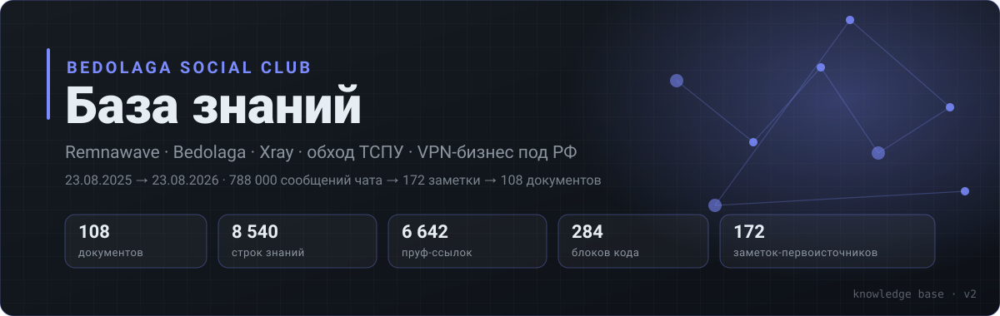

<a href="https://deepwiki.com/Rxflex/BedolagaBD"></a>

### [🗺 Карта разделов](MAP.md) · [🏷 Релизы](indexes/релизы.md) · [🩺 Ошибки](indexes/ошибки.md) · [🔧 Env](indexes/env.md) · [📖 Термины](indexes/термины.md) · [🔗 Ссылки](indexes/ссылки.md) · [🗃 Первоисточники](source/README.md)

</div>

[](https://github.com/Rxflex/BedolagaBD/actions/workflows/checks.yml)
[](LICENSE)
[](LICENSE)
[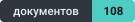](docs/README.md)
[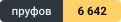](indexes/термины.md)
[](docs/08-хронология/README.md)

---

Год жизни сообщества **Bedolaga Social Club** (Remnawave · Bedolaga · Xray · обход ТСПУ), выжатый в справочник: **788 000 сообщений → 172 заметки → 108 документов**, каждый факт с пруфом на сообщение.

Период: **23.08.2025 → 23.08.2026**. Внутри — дословные конфиги и команды, а не пересказ: `Xray`-инбаунды, `docker-compose`, `.env`, `Caddyfile`, `sysctl`, bash-скрипты, разборы ~260 поломок, цены и опыт по ~50 хостерам, профили платёжек и хронология блокировок по датам.

## 📚 Разделы

| | Раздел | О чём | Док. | Пруфов |
|---|---|---|---:|---:|
| 🛠 | **[01 · Панели](docs/01-панели/README.md)** | Remnawave, Bedolaga-бот, Cabinet, admin-панели, миграции | 11 | 2348 |
| 🔌 | **[02 · Транспорты](docs/02-транспорты/README.md)** | Reality, XHTTP, gRPC, WS, Hysteria2, SS-2022, клиенты | 15 | 165 |
| 🛡 | **[03 · Обход ТСПУ](docs/03-обход-тспу/README.md)** | блокировки по датам, CDN-фронтинг, БС, мосты, детект | 13 | 335 |
| 🖧 | **[04 · Сеть и серверы](docs/04-сеть-серверы/README.md)** | sysctl/BBR, firewall, реверс-прокси, сертификаты, бэкапы | 12 | 319 |
| 🌍 | **[05 · Хостинги](docs/05-хостинги/README.md)** | ~50 хостеров: цены, пинги, ТСПУ-статусы, подсети | 16 | 436 |
| 💳 | **[06 · Платёжки и бизнес](docs/06-платёжки/README.md)** | комиссии, вебхуки, юнит-экономика, право, скам | 11 | 539 |
| ⚙ | **[07 · Скрипты и API](docs/07-скрипты/README.md)** | установщики, чекеры, мониторинг, API и вебхуки | 14 | 266 |
| 🗓 | **[08 · Хронология](docs/08-хронология/README.md)** | 1940 вех месяц за месяцем: отвалы, релизы, изъятия | 16 | 2234 |

## 🔎 Как искать

| Способ | Куда идти |
|---|---|
| **Спросить словами** | [🤖 DeepWiki](https://deepwiki.com/Rxflex/BedolagaBD) — ИИ-агент прочитал репозиторий и отвечает на вопросы со ссылками на документы |
| **Глазами** | [🗺 Карта разделов](MAP.md) — все 108 документов и их подразделы на одной странице |
| **По сущности** | [🏷 версия](indexes/релизы.md) · [🩺 ошибка](indexes/ошибки.md) · [🔧 env-переменная](indexes/env.md) · [🔗 ссылка](indexes/ссылки.md) · [📖 термин](indexes/термины.md) |
| **По дате** | [🗓 хронология по месяцам](docs/08-хронология/README.md) — 1940 вех с 03.2024 по 08.2026 |
| **По теме** | хаб раздела: [01](docs/01-панели/README.md) · [02](docs/02-транспорты/README.md) · [03](docs/03-обход-тспу/README.md) · [04](docs/04-сеть-серверы/README.md) · [05](docs/05-хостинги/README.md) · [06](docs/06-платёжки/README.md) · [07](docs/07-скрипты/README.md) · [08](docs/08-хронология/README.md) |

Грепом — быстрее всего:

```bash
grep -rn "CONNECT_BUTTON_MODE" docs/          # где описана переменная
grep -rn "16.06.2026" docs/08-хронология/     # что было в этот день
grep -rln "hysteria" docs/                    # какие документы вообще про транспорт
grep -rn "id=698034" docs/ source/            # факт и его первоисточник
```

## 🗺 Схемы

<details open>
<summary><b>Стек: что с чем разговаривает</b></summary>

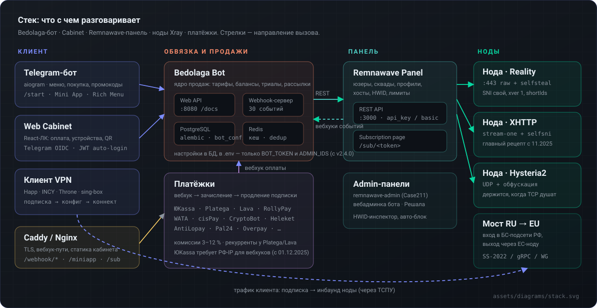

Бот, панель, кабинет, ноды и платёжки — кто кого вызывает. Подробности: [01 Панели](docs/01-панели/README.md), [07 API](docs/07-скрипты/api.md).

</details>

<details open>
<summary><b>Транспорты: что работало и когда</b></summary>

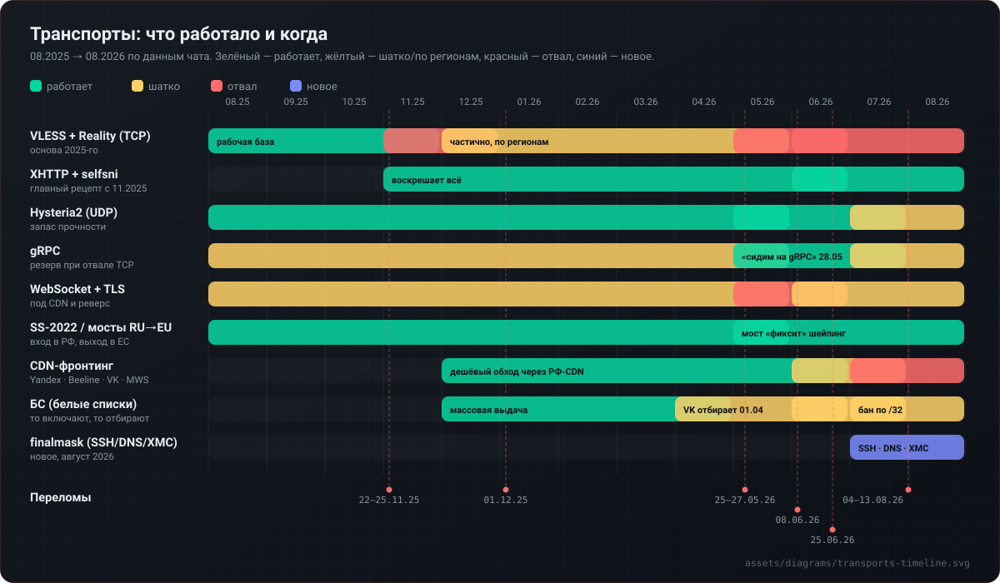

Переломы года: **22–25.11.2025** массовый отвал Reality · **01.12.2025** ЮKassa только с РФ-IP · **25–27.05.2026** детект TLS-in-TLS и fingerprint chrome · **08.06.2026** «БСЫ ВСЁ» + падение MIRhosting · **25.06.2026** VLESS забанен у многих · **04–13.08.2026** снесли CDN-аккаунты Beeline, VK, Yandex. Детали: [03 Хронология](docs/03-обход-тспу/хронология.md), [02 Вехи](docs/02-транспорты/вехи.md).

</details>

<details>
<summary><b>ТСПУ: что видит и чем закрывались</b></summary>

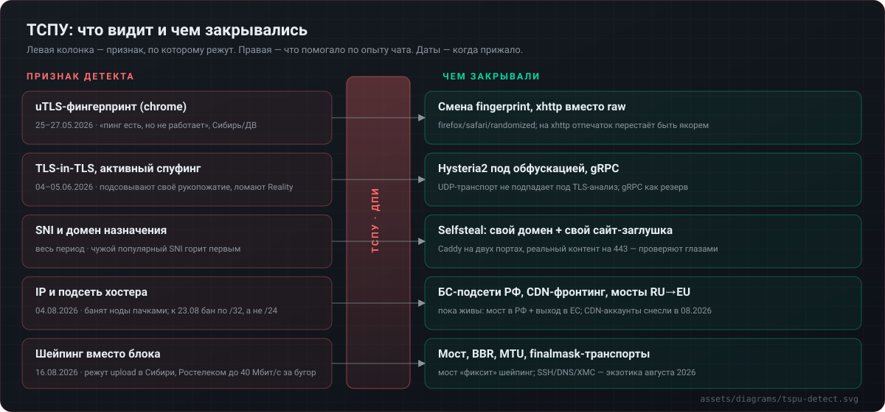

Признак детекта → рабочая контрмера. Подробности: [03 Детект](docs/03-обход-тспу/детект-fingerprint.md), [03 Методы обхода](docs/03-обход-тспу/методы-обхода.md).

</details>

<details>
<summary><b>Путь денег: от кнопки до продления</b></summary>

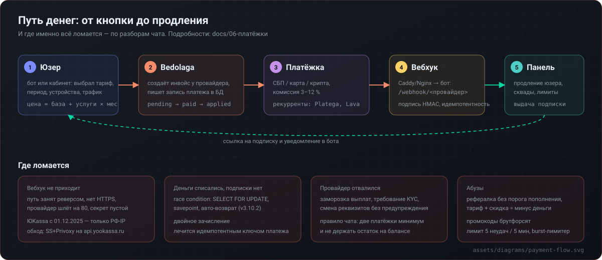

Пять шагов и четыре типовые поломки. Подробности: [06 Платёжки](docs/06-платёжки/README.md).

</details>

## 🧾 Как читать факты

Каждый факт снабжён пруфом: `[id=698034|YukiOff1cial|16.06.2026]` — номер сообщения в чате, автор, дата. **Пруф кликается** и ведёт прямо на сообщение в Telegram (`t.me/c/2941121338/698034`), открывается у участников чата.

- Нужен исходный текст сообщения без Telegram → [source/README.md](source/README.md): по диапазону id находите заметку, в ней тот же `[id=...]` рядом с дословной цитатой.
- `note_045` в тексте — ссылка на ту же заметку: [source/notes/note_045.md](source/notes/note_045.md).
- Даты всегда абсолютные (ДД.ММ.ГГГГ). Устаревшее не удалено, а помечено датой: в этой теме «что работало» меняется каждые два месяца.
- Противоречия оставлены как есть, с обеими версиями — чат не всегда сходился во мнениях.

> [!WARNING]
> Это архив опыта сообщества, а не инструкция и не руководство к действию. Часть методов на 2026 год уже нерабочие, часть описана в контексте российского регулирования — правовые оценки в [06 Право РФ](docs/06-платёжки/право-рф.md) взяты из обсуждений чата и не являются юридической консультацией.

## 🗂 Структура репозитория

<details>
<summary>Дерево и что где лежит</summary>

```
README.md              — эта страница
MAP.md                 — карта всех разделов (генерится)
docs/
  01-панели/           — 11 документов + README-хаб раздела
  02-транспорты/       — 15
  03-обход-тспу/       — 13
  04-сеть-серверы/     — 12
  05-хостинги/         — 16
  06-платёжки/         — 11
  07-скрипты/          — 14
  08-хронология/       — 16 файлов по месяцам (2024-03 … 2026-08)
indexes/
  релизы.md            — 222 версии: что, когда, где описано   (генерится)
  ошибки.md            — 257 симптомов → фикс                    (генерится)
  env.md               — 533 переменные окружения              (генерится)
  ссылки.md            — 304 внешние ссылки                   (генерится)
  термины.md           — глоссарий и жаргон                    (пишется руками)
source/
  README.md            — указатель заметок-первоисточников
  notes/               — 172 заметки с дословными цитатами и id
assets/
  banner.svg, map.svg, sections/*.svg, diagrams/*.svg
_tools/                — генераторы навигации, индексов, графики и оформления
  data/threads.tsv     — id сообщения → id форум-треда (для пруф-ссылок)
.github/               — шаблоны issue/PR и CI-проверки
LICENSE                — CC BY-SA 4.0 на базу, MIT на _tools
CONTRIBUTING.md        — как дополнять базу
SECURITY.md            — приватность, утечки, удаление данных
CODE_OF_CONDUCT.md     — правила общения
CHANGELOG.md           — история изменений базы
```

Правило: **правят только `docs/**` и `indexes/термины.md`**. Всё остальное (`MAP.md`, индексы, навигационные блоки, баннеры) пересобирается скриптами.

</details>

<details>
<summary>Как пересобрать после правок</summary>

```bash
python _tools/build_nav.py        # шапки/подвалы документов, хабы разделов, MAP.md
python _tools/build_indexes.py    # indexes: релизы, ошибки, env, ссылки
python _tools/build_assets.py     # баннеры разделов и главный баннер
python _tools/build_timeline.py   # таймлайн транспортов
python _tools/build_source.py     # перенос заметок из _extraction и указатель
python _tools/check_links.py      # проверка всех внутренних ссылок и якорей

# разовые пассы оформления (идемпотентны, можно гонять повторно)
python _tools/prettify_links.py   # голые URL → компактные markdown-ссылки
python _tools/tables_for_links.py # ссылочные свалки → таблицы «Что | Ссылка | Пруф»
python _tools/link_proofs.py      # [id=N] → ссылка на сообщение в Telegram
python _tools/sanitize.py         # обезличивание имён, заглушки секретов
python _tools/pii_scan.py         # скан утечек: ключи, токены, ПД
python _tools/build_donate.py     # карточки донатов с QR
```

`link_proofs.py` берёт треды из `_tools/data/threads.tsv`; если справочника нет, он парсит HTML-экспорт чата (`--export "<путь>"`) и собирает его заново.

Спека структуры (какие файлы в каком разделе, названия, цвета) — одна: [`_tools/kb_lib.py`](_tools/kb_lib.py).

</details>

<details>
<summary>Что намеренно не вошло</summary>

Мемы, флуд, личные перепалки, реклама услуг без фактов опыта. Приоритет при отборе: дословные конфиги и команды → методики → даты и факты. Исходный HTML-экспорт чата (`messages*.html`) и текстовые чанки (99 МБ) в репозиторий не кладутся — из них остались заметки в [`source/notes`](source/notes).

</details>

## 🤝 Участие и правила

| | |
|---|---|
| [**Как дополнять базу**](CONTRIBUTING.md) | формат записи, правило «нет пруфа — нет записи», порядок пересборки |
| [**Приватность и удаление данных**](SECURITY.md) | что считается утечкой, как сообщить, как убрать свои сообщения |
| [**Правила общения**](CODE_OF_CONDUCT.md) | как спорить по фактам и что в issue не приветствуется |
| [**Лицензии**](LICENSE) | база — CC BY-SA 4.0, скрипты в `_tools` — MIT |
| [**История изменений**](CHANGELOG.md) | что и когда менялось в самой базе |

**Приватность.** Материал из приватного чата, поэтому перед публикацией: полные имена участников
обезличены до формата «Имя Ф.» (308 имён, 2 600+ упоминаний), реальные секреты из чужих конфигов
заменены заглушками, телефоны скрыты, адреса чужих открытых панелей замаскированы. Скан
[`_tools/pii_scan.py`](_tools/pii_scan.py) гоняется в CI на каждый PR. Нашли что-то лишнее —
[SECURITY.md](SECURITY.md), уберём без обсуждения.

## 💚 Поддержать

<div align="center">

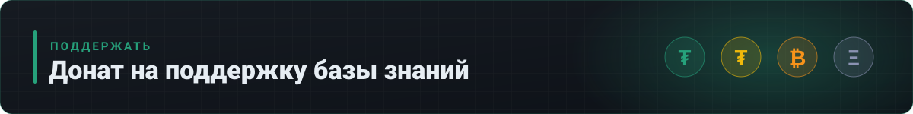

<table>
<tr>
<td align="center" width="25%">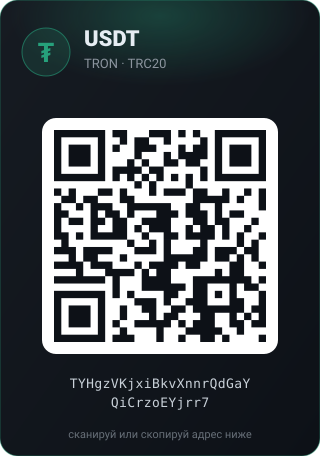</td>
<td align="center" width="25%">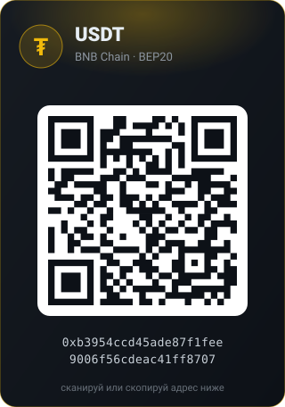</td>
<td align="center" width="25%"></td>
<td align="center" width="25%">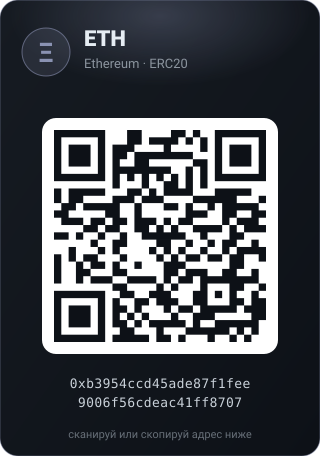</td>
</tr>
</table>

</div>

Адреса для копирования:

| | Монета | Сеть | Адрес |
|---|---|---|---|
| 🟢 | **USDT** | TRON · TRC20 | `TYHgzVKjxiBkvXnnrQdGaYQiCrzoEYjrr7` |
| 🟡 | **USDT** | BNB Chain · BEP20 | `0xb3954ccd45ade87f1fee9006f56cdeac41ff8707` |
| 🟠 | **BTC** | Bitcoin | `1JxKsR9hBXqdWdJYSQpogWEtZKo8ZdnZGG` |
| ⚪ | **ETH** | Ethereum · ERC20 | `0xb3954ccd45ade87f1fee9006f56cdeac41ff8707` |

> Сеть у USDT важна: TRC20 и BEP20 — разные адреса, перепутаешь — деньги не придут. Адреса в QR-кодах и в таблице совпадают.

## 🤖 Для ИИ-агентов

Отдельная страница-карта: [AGENTS.md](AGENTS.md) — где что лежит, какие соглашения в формате, какие грепы дают ответ за один вызов.

---

<div align="center">

**[🗺 Карта](MAP.md)** · [🏷 Релизы](indexes/релизы.md) · [🩺 Ошибки](indexes/ошибки.md) · [🔧 Env](indexes/env.md) · [📖 Термины](indexes/термины.md) · [🔗 Ссылки](indexes/ссылки.md) · [🗃 Первоисточники](source/README.md)

<sub>Собрано из чата «Bedolaga Social Club», 23.08.2025 – 23.08.2026 · 9 979 строк знаний · 6 642 пруфа · 284 блока кода</sub>

</div>
