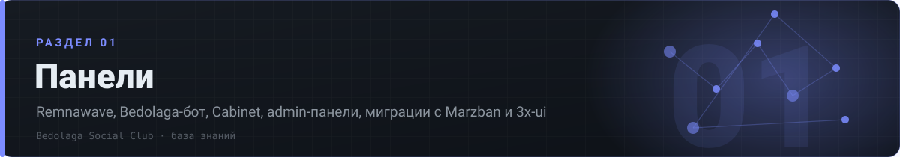

# 🛠 01 · Панели

> Remnawave, Bedolaga-бот, Cabinet, admin-панели, миграции с Marzban и 3x-ui

[⌂ База знаний](../../README.md) · [🗺 Карта](../../MAP.md) · Индексы: [релизы](../../indexes/релизы.md) · [ошибки](../../indexes/ошибки.md) · [env](../../indexes/env.md) · [термины](../../indexes/термины.md) · [ссылки](../../indexes/ссылки.md)

`11 документов` · `3540 строк` · `2348 пруфов` · `163 блоков кода`

---

## Документы раздела

| # | Документ | О чём | Строк | Пруфов |
|---|---|---|---:|---:|
| 1 | **[Релизы](релизы.md)** | каталог версий Bedolaga v2.0.4→v4.1.0, Cabinet 1.1→1.65, Remnawave 2.1.9→3.3.0 | 482 | 477 |
| 2 | **[Установка и обновление](установка-обновление.md)** | команды, порядок поднятия, миграции, откаты | 506 | 231 |
| 3 | **[Docker-compose](docker-compose.md)** | рабочие compose-файлы бота, панели, кабинета, сабпейджа | 497 | 91 |
| 4 | **[Env-переменные](env.md)** | дословные .env по периодам: бот, кабинет, панель, платёжки | 756 | 299 |
| 5 | **[Nginx / Caddy](reverse-proxy.md)** | реверс для панели, вебхуков, миниаппы, кабинета | 26 | 14 |
| 6 | **[Конфиги и настройки](конфиги-настройки.md)** | Burst Observatory, XHTTP-inject, Rich Menu, логи нод | 33 | 5 |
| 7 | **[Ошибки → фиксы](ошибки-фиксы.md)** | ~150 разобранных поломок: миграции, вебхуки, кабинет, панель | 420 | 524 |
| 8 | **[Admin-панели](admin-панели.md)** | remnawave-admin, вебадминка бота, дашборды, плагины | 155 | 190 |
| 9 | **[Кейсы и разборы](кейсы.md)** | живые разборы обновлений и багов | 58 | 91 |
| 10 | **[Marzban и 3x-ui](marzban-3x-ui.md)** | миграции, сравнение, остатки старого стека | 56 | 93 |
| 11 | **[Ссылки и инструменты](ссылки-инструменты.md)** | репозитории экосистемы, документация, утилиты | 551 | 333 |

---

## Что внутри документов

<b>Релизы</b> — 14 разделов

- [Период 23.08–07.09.2025 — Bedolaga v2.0.x–2.2.x, Remnawave 2.1.x](релизы.md#период-230807092025--bedolaga-v20x22x-remnawave-21x)
- [Период 12.11.2025–01.01.2026 — Bedolaga v2.7–2.9.4, Remnawave 2.3–2.4](релизы.md#период-1211202501012026--bedolaga-v27294-remnawave-2324)
- [Период 09.02–13.03.2026 — Bedolaga v3.9–3.32, Remnawave 2.6.x, Remnawave-admin 2.x](релизы.md#период-090213032026--bedolaga-v39332-remnawave-26x-remnawave-admin-2x)
- [Период 16.03–06.04.2026 — Remnawave 2.7.x (breaking), Bedolaga v3.33–3.45](релизы.md#период-160306042026--remnawave-27x-breaking-bedolaga-v333345)
- [Период 06–25.04.2026 — Bedolaga v3.45–3.52, Remnawave-admin 2.9–2.11](релизы.md#период-0625042026--bedolaga-v345352-remnawave-admin-29211)
- [Период 25.04–15.05.2026 — Bedolaga v3.49–3.55, Cabinet 1.49–1.52](релизы.md#период-250415052026--bedolaga-v349355-cabinet-149152)
- [Период 16.05–05.06.2026 — Bedolaga v3.56–3.58, Remnawave-admin 2.14](релизы.md#период-160505062026--bedolaga-v356358-remnawave-admin-214)
- [Период 07–26.06.2026 — Bedolaga 3.60–3.61, Subscription-page 7.2.5/7.2.6](релизы.md#период-0726062026--bedolaga-360361-subscription-page-725726)
- [Период 26.06–08.07.2026 — Remnawave 2.8.0, Bedolaga v3.61–3.62, Cabinet 1.59](релизы.md#период-260608072026--remnawave-280-bedolaga-v361362-cabinet-159)
- [Период 08–20.07.2026 — Remnawave 2.8.1, Bedolaga v3.62–3.64, Cabinet 1.61](релизы.md#период-0820072026--remnawave-281-bedolaga-v362364-cabinet-161)
- [Период 20–31.07.2026 — Bedolaga v3.66/3.67 + Cabinet 1.64 (рекурренты Platega/Lava)](релизы.md#период-2031072026--bedolaga-v366367--cabinet-164-рекурренты-plategalava)
- [Период 31.07–09.08.2026 — Remnawave 3.0.0 (ломающий), Bedolaga v4.0.0, Cabinet 1.65](релизы.md#период-310709082026--remnawave-300-ломающий-bedolaga-v400-cabinet-165)
- [Период 09–20.08.2026 — Remnawave 3.2.3/3.3.0, Bedolaga v4.1.0 (GeoCheck)](релизы.md#период-0920082026--remnawave-323330-bedolaga-v410-geocheck)
- [Период 20–23.08.2026 — совместимость 2.8.x/3.2.2, GHCR, пин-борда](релизы.md#период-2023082026--совместимость-28x322-ghcr-пин-борда)

<b>Установка и обновление</b> — 14 разделов

- [Период 23.08–07.09.2025 — Bedolaga v2.0.x–2.2.x, Remnawave 2.1.x](установка-обновление.md#период-230807092025--bedolaga-v20x22x-remnawave-21x)
- [Период 12.11.2025–01.01.2026 — Bedolaga v2.7–2.9.4, Remnawave 2.3–2.4](установка-обновление.md#период-1211202501012026--bedolaga-v27294-remnawave-2324)
- [Период 09.02–13.03.2026 — Bedolaga v3.9–3.32, Remnawave 2.6.x, Remnawave-admin 2.x](установка-обновление.md#период-090213032026--bedolaga-v39332-remnawave-26x-remnawave-admin-2x)
- [Период 16.03–06.04.2026 — Remnawave 2.7.x (breaking), Bedolaga v3.33–3.45](установка-обновление.md#период-160306042026--remnawave-27x-breaking-bedolaga-v333345)
- [Период 06–25.04.2026 — Bedolaga v3.45–3.52, Remnawave-admin 2.9–2.11](установка-обновление.md#период-0625042026--bedolaga-v345352-remnawave-admin-29211)
- [Период 25.04–15.05.2026 — Bedolaga v3.49–3.55, Cabinet 1.49–1.52](установка-обновление.md#период-250415052026--bedolaga-v349355-cabinet-149152)
- [Период 16.05–05.06.2026 — Bedolaga v3.56–3.58, Remnawave-admin 2.14](установка-обновление.md#период-160505062026--bedolaga-v356358-remnawave-admin-214)
- [Период 07–26.06.2026 — Bedolaga 3.60–3.61, Subscription-page 7.2.5/7.2.6](установка-обновление.md#период-0726062026--bedolaga-360361-subscription-page-725726)
- [Период 26.06–08.07.2026 — Remnawave 2.8.0, Bedolaga v3.61–3.62, Cabinet 1.59](установка-обновление.md#период-260608072026--remnawave-280-bedolaga-v361362-cabinet-159)
- [Период 08–20.07.2026 — Remnawave 2.8.1, Bedolaga v3.62–3.64, Cabinet 1.61](установка-обновление.md#период-0820072026--remnawave-281-bedolaga-v362364-cabinet-161)
- [Период 20–31.07.2026 — Bedolaga v3.66/3.67 + Cabinet 1.64 (рекурренты Platega/Lava)](установка-обновление.md#период-2031072026--bedolaga-v366367--cabinet-164-рекурренты-plategalava)
- [Период 31.07–09.08.2026 — Remnawave 3.0.0 (ломающий), Bedolaga v4.0.0, Cabinet 1.65](установка-обновление.md#период-310709082026--remnawave-300-ломающий-bedolaga-v400-cabinet-165)
- [Период 09–20.08.2026 — Remnawave 3.2.3/3.3.0, Bedolaga v4.1.0 (GeoCheck)](установка-обновление.md#период-0920082026--remnawave-323330-bedolaga-v410-geocheck)
- [Период 20–23.08.2026 — совместимость 2.8.x/3.2.2, GHCR, пин-борда](установка-обновление.md#период-2023082026--совместимость-28x322-ghcr-пин-борда)

<b>Docker-compose</b> — 14 разделов

- [Период 23.08–07.09.2025 — Bedolaga v2.0.x–2.2.x, Remnawave 2.1.x](docker-compose.md#период-230807092025--bedolaga-v20x22x-remnawave-21x)
- [Период 12.11.2025–01.01.2026 — Bedolaga v2.7–2.9.4, Remnawave 2.3–2.4](docker-compose.md#период-1211202501012026--bedolaga-v27294-remnawave-2324)
- [Период 09.02–13.03.2026 — Bedolaga v3.9–3.32, Remnawave 2.6.x, Remnawave-admin 2.x](docker-compose.md#период-090213032026--bedolaga-v39332-remnawave-26x-remnawave-admin-2x)
- [Период 16.03–06.04.2026 — Remnawave 2.7.x (breaking), Bedolaga v3.33–3.45](docker-compose.md#период-160306042026--remnawave-27x-breaking-bedolaga-v333345)
- [Период 06–25.04.2026 — Bedolaga v3.45–3.52, Remnawave-admin 2.9–2.11](docker-compose.md#период-0625042026--bedolaga-v345352-remnawave-admin-29211)
- [Период 25.04–15.05.2026 — Bedolaga v3.49–3.55, Cabinet 1.49–1.52](docker-compose.md#период-250415052026--bedolaga-v349355-cabinet-149152)
- [Период 16.05–05.06.2026 — Bedolaga v3.56–3.58, Remnawave-admin 2.14](docker-compose.md#период-160505062026--bedolaga-v356358-remnawave-admin-214)
- [Период 07–26.06.2026 — Bedolaga 3.60–3.61, Subscription-page 7.2.5/7.2.6](docker-compose.md#период-0726062026--bedolaga-360361-subscription-page-725726)
- [Период 26.06–08.07.2026 — Remnawave 2.8.0, Bedolaga v3.61–3.62, Cabinet 1.59](docker-compose.md#период-260608072026--remnawave-280-bedolaga-v361362-cabinet-159)
- [Период 08–20.07.2026 — Remnawave 2.8.1, Bedolaga v3.62–3.64, Cabinet 1.61](docker-compose.md#период-0820072026--remnawave-281-bedolaga-v362364-cabinet-161)
- [Период 20–31.07.2026 — Bedolaga v3.66/3.67 + Cabinet 1.64 (рекурренты Platega/Lava)](docker-compose.md#период-2031072026--bedolaga-v366367--cabinet-164-рекурренты-plategalava)
- [Период 31.07–09.08.2026 — Remnawave 3.0.0 (ломающий), Bedolaga v4.0.0, Cabinet 1.65](docker-compose.md#период-310709082026--remnawave-300-ломающий-bedolaga-v400-cabinet-165)
- [Период 09–20.08.2026 — Remnawave 3.2.3/3.3.0, Bedolaga v4.1.0 (GeoCheck)](docker-compose.md#период-0920082026--remnawave-323330-bedolaga-v410-geocheck)
- [Период 20–23.08.2026 — совместимость 2.8.x/3.2.2, GHCR, пин-борда](docker-compose.md#период-2023082026--совместимость-28x322-ghcr-пин-борда)

<b>Env-переменные</b> — 14 разделов

- [Период 23.08–07.09.2025 — Bedolaga v2.0.x–2.2.x, Remnawave 2.1.x](env.md#период-230807092025--bedolaga-v20x22x-remnawave-21x)
- [Период 12.11.2025–01.01.2026 — Bedolaga v2.7–2.9.4, Remnawave 2.3–2.4](env.md#период-1211202501012026--bedolaga-v27294-remnawave-2324)
- [Период 09.02–13.03.2026 — Bedolaga v3.9–3.32, Remnawave 2.6.x, Remnawave-admin 2.x](env.md#период-090213032026--bedolaga-v39332-remnawave-26x-remnawave-admin-2x)
- [Период 16.03–06.04.2026 — Remnawave 2.7.x (breaking), Bedolaga v3.33–3.45](env.md#период-160306042026--remnawave-27x-breaking-bedolaga-v333345)
- [Период 06–25.04.2026 — Bedolaga v3.45–3.52, Remnawave-admin 2.9–2.11](env.md#период-0625042026--bedolaga-v345352-remnawave-admin-29211)
- [Период 25.04–15.05.2026 — Bedolaga v3.49–3.55, Cabinet 1.49–1.52](env.md#период-250415052026--bedolaga-v349355-cabinet-149152)
- [Период 16.05–05.06.2026 — Bedolaga v3.56–3.58, Remnawave-admin 2.14](env.md#период-160505062026--bedolaga-v356358-remnawave-admin-214)
- [Период 07–26.06.2026 — Bedolaga 3.60–3.61, Subscription-page 7.2.5/7.2.6](env.md#период-0726062026--bedolaga-360361-subscription-page-725726)
- [Период 26.06–08.07.2026 — Remnawave 2.8.0, Bedolaga v3.61–3.62, Cabinet 1.59](env.md#период-260608072026--remnawave-280-bedolaga-v361362-cabinet-159)
- [Период 08–20.07.2026 — Remnawave 2.8.1, Bedolaga v3.62–3.64, Cabinet 1.61](env.md#период-0820072026--remnawave-281-bedolaga-v362364-cabinet-161)
- [Период 20–31.07.2026 — Bedolaga v3.66/3.67 + Cabinet 1.64 (рекурренты Platega/Lava)](env.md#период-2031072026--bedolaga-v366367--cabinet-164-рекурренты-plategalava)
- [Период 31.07–09.08.2026 — Remnawave 3.0.0 (ломающий), Bedolaga v4.0.0, Cabinet 1.65](env.md#период-310709082026--remnawave-300-ломающий-bedolaga-v400-cabinet-165)
- [Период 09–20.08.2026 — Remnawave 3.2.3/3.3.0, Bedolaga v4.1.0 (GeoCheck)](env.md#период-0920082026--remnawave-323330-bedolaga-v410-geocheck)
- [Период 20–23.08.2026 — совместимость 2.8.x/3.2.2, GHCR, пин-борда](env.md#период-2023082026--совместимость-28x322-ghcr-пин-борда)

<b>Nginx / Caddy</b> — 2 разделов

- [Период 09.02–13.03.2026 — Bedolaga v3.9–3.32, Remnawave 2.6.x, Remnawave-admin 2.x](reverse-proxy.md#период-090213032026--bedolaga-v39332-remnawave-26x-remnawave-admin-2x)
- [Период 16.03–06.04.2026 — Remnawave 2.7.x (breaking), Bedolaga v3.33–3.45](reverse-proxy.md#период-160306042026--remnawave-27x-breaking-bedolaga-v333345)

<b>Конфиги и настройки</b> — 1 разделов

- [Период 31.07–09.08.2026 — Remnawave 3.0.0 (ломающий), Bedolaga v4.0.0, Cabinet 1.65](конфиги-настройки.md#период-310709082026--remnawave-300-ломающий-bedolaga-v400-cabinet-165)

<b>Ошибки → фиксы</b> — 14 разделов

- [Период 23.08–07.09.2025 — Bedolaga v2.0.x–2.2.x, Remnawave 2.1.x](ошибки-фиксы.md#период-230807092025--bedolaga-v20x22x-remnawave-21x)
- [Период 12.11.2025–01.01.2026 — Bedolaga v2.7–2.9.4, Remnawave 2.3–2.4](ошибки-фиксы.md#период-1211202501012026--bedolaga-v27294-remnawave-2324)
- [Период 09.02–13.03.2026 — Bedolaga v3.9–3.32, Remnawave 2.6.x, Remnawave-admin 2.x](ошибки-фиксы.md#период-090213032026--bedolaga-v39332-remnawave-26x-remnawave-admin-2x)
- [Период 16.03–06.04.2026 — Remnawave 2.7.x (breaking), Bedolaga v3.33–3.45](ошибки-фиксы.md#период-160306042026--remnawave-27x-breaking-bedolaga-v333345)
- [Период 06–25.04.2026 — Bedolaga v3.45–3.52, Remnawave-admin 2.9–2.11](ошибки-фиксы.md#период-0625042026--bedolaga-v345352-remnawave-admin-29211)
- [Период 25.04–15.05.2026 — Bedolaga v3.49–3.55, Cabinet 1.49–1.52](ошибки-фиксы.md#период-250415052026--bedolaga-v349355-cabinet-149152)
- [Период 16.05–05.06.2026 — Bedolaga v3.56–3.58, Remnawave-admin 2.14](ошибки-фиксы.md#период-160505062026--bedolaga-v356358-remnawave-admin-214)
- [Период 07–26.06.2026 — Bedolaga 3.60–3.61, Subscription-page 7.2.5/7.2.6](ошибки-фиксы.md#период-0726062026--bedolaga-360361-subscription-page-725726)
- [Период 26.06–08.07.2026 — Remnawave 2.8.0, Bedolaga v3.61–3.62, Cabinet 1.59](ошибки-фиксы.md#период-260608072026--remnawave-280-bedolaga-v361362-cabinet-159)
- [Период 08–20.07.2026 — Remnawave 2.8.1, Bedolaga v3.62–3.64, Cabinet 1.61](ошибки-фиксы.md#период-0820072026--remnawave-281-bedolaga-v362364-cabinet-161)
- [Период 20–31.07.2026 — Bedolaga v3.66/3.67 + Cabinet 1.64 (рекурренты Platega/Lava)](ошибки-фиксы.md#период-2031072026--bedolaga-v366367--cabinet-164-рекурренты-plategalava)
- [Период 31.07–09.08.2026 — Remnawave 3.0.0 (ломающий), Bedolaga v4.0.0, Cabinet 1.65](ошибки-фиксы.md#период-310709082026--remnawave-300-ломающий-bedolaga-v400-cabinet-165)
- [Период 09–20.08.2026 — Remnawave 3.2.3/3.3.0, Bedolaga v4.1.0 (GeoCheck)](ошибки-фиксы.md#период-0920082026--remnawave-323330-bedolaga-v410-geocheck)
- [Период 20–23.08.2026 — совместимость 2.8.x/3.2.2, GHCR, пин-борда](ошибки-фиксы.md#период-2023082026--совместимость-28x322-ghcr-пин-борда)

<b>Admin-панели</b> — 14 разделов

- [Период 23.08–07.09.2025 — Bedolaga v2.0.x–2.2.x, Remnawave 2.1.x](admin-панели.md#период-230807092025--bedolaga-v20x22x-remnawave-21x)
- [Период 12.11.2025–01.01.2026 — Bedolaga v2.7–2.9.4, Remnawave 2.3–2.4](admin-панели.md#период-1211202501012026--bedolaga-v27294-remnawave-2324)
- [Период 09.02–13.03.2026 — Bedolaga v3.9–3.32, Remnawave 2.6.x, Remnawave-admin 2.x](admin-панели.md#период-090213032026--bedolaga-v39332-remnawave-26x-remnawave-admin-2x)
- [Период 16.03–06.04.2026 — Remnawave 2.7.x (breaking), Bedolaga v3.33–3.45](admin-панели.md#период-160306042026--remnawave-27x-breaking-bedolaga-v333345)
- [Период 06–25.04.2026 — Bedolaga v3.45–3.52, Remnawave-admin 2.9–2.11](admin-панели.md#период-0625042026--bedolaga-v345352-remnawave-admin-29211)
- [Период 25.04–15.05.2026 — Bedolaga v3.49–3.55, Cabinet 1.49–1.52](admin-панели.md#период-250415052026--bedolaga-v349355-cabinet-149152)
- [Период 16.05–05.06.2026 — Bedolaga v3.56–3.58, Remnawave-admin 2.14](admin-панели.md#период-160505062026--bedolaga-v356358-remnawave-admin-214)
- [Период 07–26.06.2026 — Bedolaga 3.60–3.61, Subscription-page 7.2.5/7.2.6](admin-панели.md#период-0726062026--bedolaga-360361-subscription-page-725726)
- [Период 26.06–08.07.2026 — Remnawave 2.8.0, Bedolaga v3.61–3.62, Cabinet 1.59](admin-панели.md#период-260608072026--remnawave-280-bedolaga-v361362-cabinet-159)
- [Период 08–20.07.2026 — Remnawave 2.8.1, Bedolaga v3.62–3.64, Cabinet 1.61](admin-панели.md#период-0820072026--remnawave-281-bedolaga-v362364-cabinet-161)
- [Период 20–31.07.2026 — Bedolaga v3.66/3.67 + Cabinet 1.64 (рекурренты Platega/Lava)](admin-панели.md#период-2031072026--bedolaga-v366367--cabinet-164-рекурренты-plategalava)
- [Период 31.07–09.08.2026 — Remnawave 3.0.0 (ломающий), Bedolaga v4.0.0, Cabinet 1.65](admin-панели.md#период-310709082026--remnawave-300-ломающий-bedolaga-v400-cabinet-165)
- [Период 09–20.08.2026 — Remnawave 3.2.3/3.3.0, Bedolaga v4.1.0 (GeoCheck)](admin-панели.md#период-0920082026--remnawave-323330-bedolaga-v410-geocheck)
- [Период 20–23.08.2026 — совместимость 2.8.x/3.2.2, GHCR, пин-борда](admin-панели.md#период-2023082026--совместимость-28x322-ghcr-пин-борда)

<b>Кейсы и разборы</b> — 1 разделов

- [Период 09–20.08.2026 — Remnawave 3.2.3/3.3.0, Bedolaga v4.1.0 (GeoCheck)](кейсы.md#период-0920082026--remnawave-323330-bedolaga-v410-geocheck)

<b>Marzban и 3x-ui</b> — 14 разделов

- [Период 23.08–07.09.2025 — Bedolaga v2.0.x–2.2.x, Remnawave 2.1.x](marzban-3x-ui.md#период-230807092025--bedolaga-v20x22x-remnawave-21x)
- [Период 12.11.2025–01.01.2026 — Bedolaga v2.7–2.9.4, Remnawave 2.3–2.4](marzban-3x-ui.md#период-1211202501012026--bedolaga-v27294-remnawave-2324)
- [Период 09.02–13.03.2026 — Bedolaga v3.9–3.32, Remnawave 2.6.x, Remnawave-admin 2.x](marzban-3x-ui.md#период-090213032026--bedolaga-v39332-remnawave-26x-remnawave-admin-2x)
- [Период 16.03–06.04.2026 — Remnawave 2.7.x (breaking), Bedolaga v3.33–3.45](marzban-3x-ui.md#период-160306042026--remnawave-27x-breaking-bedolaga-v333345)
- [Период 06–25.04.2026 — Bedolaga v3.45–3.52, Remnawave-admin 2.9–2.11](marzban-3x-ui.md#период-0625042026--bedolaga-v345352-remnawave-admin-29211)
- [Период 25.04–15.05.2026 — Bedolaga v3.49–3.55, Cabinet 1.49–1.52](marzban-3x-ui.md#период-250415052026--bedolaga-v349355-cabinet-149152)
- [Период 16.05–05.06.2026 — Bedolaga v3.56–3.58, Remnawave-admin 2.14](marzban-3x-ui.md#период-160505062026--bedolaga-v356358-remnawave-admin-214)
- [Период 07–26.06.2026 — Bedolaga 3.60–3.61, Subscription-page 7.2.5/7.2.6](marzban-3x-ui.md#период-0726062026--bedolaga-360361-subscription-page-725726)
- [Период 26.06–08.07.2026 — Remnawave 2.8.0, Bedolaga v3.61–3.62, Cabinet 1.59](marzban-3x-ui.md#период-260608072026--remnawave-280-bedolaga-v361362-cabinet-159)
- [Период 08–20.07.2026 — Remnawave 2.8.1, Bedolaga v3.62–3.64, Cabinet 1.61](marzban-3x-ui.md#период-0820072026--remnawave-281-bedolaga-v362364-cabinet-161)
- [Период 20–31.07.2026 — Bedolaga v3.66/3.67 + Cabinet 1.64 (рекурренты Platega/Lava)](marzban-3x-ui.md#период-2031072026--bedolaga-v366367--cabinet-164-рекурренты-plategalava)
- [Период 31.07–09.08.2026 — Remnawave 3.0.0 (ломающий), Bedolaga v4.0.0, Cabinet 1.65](marzban-3x-ui.md#период-310709082026--remnawave-300-ломающий-bedolaga-v400-cabinet-165)
- [Период 09–20.08.2026 — Remnawave 3.2.3/3.3.0, Bedolaga v4.1.0 (GeoCheck)](marzban-3x-ui.md#период-0920082026--remnawave-323330-bedolaga-v410-geocheck)
- [Период 20–23.08.2026 — совместимость 2.8.x/3.2.2, GHCR, пин-борда](marzban-3x-ui.md#период-2023082026--совместимость-28x322-ghcr-пин-борда)

<b>Ссылки и инструменты</b> — 14 разделов

- [Период 23.08–07.09.2025 — Bedolaga v2.0.x–2.2.x, Remnawave 2.1.x](ссылки-инструменты.md#период-230807092025--bedolaga-v20x22x-remnawave-21x)
- [Период 12.11.2025–01.01.2026 — Bedolaga v2.7–2.9.4, Remnawave 2.3–2.4](ссылки-инструменты.md#период-1211202501012026--bedolaga-v27294-remnawave-2324)
- [Период 09.02–13.03.2026 — Bedolaga v3.9–3.32, Remnawave 2.6.x, Remnawave-admin 2.x](ссылки-инструменты.md#период-090213032026--bedolaga-v39332-remnawave-26x-remnawave-admin-2x)
- [Период 16.03–06.04.2026 — Remnawave 2.7.x (breaking), Bedolaga v3.33–3.45](ссылки-инструменты.md#период-160306042026--remnawave-27x-breaking-bedolaga-v333345)
- [Период 06–25.04.2026 — Bedolaga v3.45–3.52, Remnawave-admin 2.9–2.11](ссылки-инструменты.md#период-0625042026--bedolaga-v345352-remnawave-admin-29211)
- [Период 25.04–15.05.2026 — Bedolaga v3.49–3.55, Cabinet 1.49–1.52](ссылки-инструменты.md#период-250415052026--bedolaga-v349355-cabinet-149152)
- [Период 16.05–05.06.2026 — Bedolaga v3.56–3.58, Remnawave-admin 2.14](ссылки-инструменты.md#период-160505062026--bedolaga-v356358-remnawave-admin-214)
- [Период 07–26.06.2026 — Bedolaga 3.60–3.61, Subscription-page 7.2.5/7.2.6](ссылки-инструменты.md#период-0726062026--bedolaga-360361-subscription-page-725726)
- [Период 26.06–08.07.2026 — Remnawave 2.8.0, Bedolaga v3.61–3.62, Cabinet 1.59](ссылки-инструменты.md#период-260608072026--remnawave-280-bedolaga-v361362-cabinet-159)
- [Период 08–20.07.2026 — Remnawave 2.8.1, Bedolaga v3.62–3.64, Cabinet 1.61](ссылки-инструменты.md#период-0820072026--remnawave-281-bedolaga-v362364-cabinet-161)
- [Период 20–31.07.2026 — Bedolaga v3.66/3.67 + Cabinet 1.64 (рекурренты Platega/Lava)](ссылки-инструменты.md#период-2031072026--bedolaga-v366367--cabinet-164-рекурренты-plategalava)
- [Период 31.07–09.08.2026 — Remnawave 3.0.0 (ломающий), Bedolaga v4.0.0, Cabinet 1.65](ссылки-инструменты.md#период-310709082026--remnawave-300-ломающий-bedolaga-v400-cabinet-165)
- [Период 09–20.08.2026 — Remnawave 3.2.3/3.3.0, Bedolaga v4.1.0 (GeoCheck)](ссылки-инструменты.md#период-0920082026--remnawave-323330-bedolaga-v410-geocheck)
- [Период 20–23.08.2026 — совместимость 2.8.x/3.2.2, GHCR, пин-борда](ссылки-инструменты.md#период-2023082026--совместимость-28x322-ghcr-пин-борда)

---

[🔌 02. Транспорты](../02-транспорты/README.md) ▶

[⌂ База знаний](../../README.md) · [🗺 Карта](../../MAP.md) · Индексы: [релизы](../../indexes/релизы.md) · [ошибки](../../indexes/ошибки.md) · [env](../../indexes/env.md) · [термины](../../indexes/термины.md) · [ссылки](../../indexes/ссылки.md)
