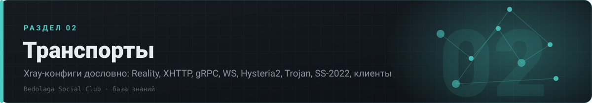

# 🔌 02 · Транспорты

> Xray-конфиги дословно: Reality, XHTTP, gRPC, WS, Hysteria2, Trojan, SS-2022, клиенты

[⌂ База знаний](../../README.md) · [🗺 Карта](../../MAP.md) · Индексы: [релизы](../../indexes/релизы.md) · [ошибки](../../indexes/ошибки.md) · [env](../../indexes/env.md) · [термины](../../indexes/термины.md) · [ссылки](../../indexes/ссылки.md)

`15 документов` · `283 строк` · `165 пруфов` · `14 блоков кода`

---

## Документы раздела

| # | Документ | О чём | Строк | Пруфов |
|---|---|---|---:|---:|
| 1 | **[VLESS + Reality](reality.md)** | базовый рецепт инбаунда, xver, shortIds, destOverride | 32 | 11 |
| 2 | **[XHTTP](xhttp.md)** | главный рецепт с 11.2025: selfsni, режимы, padding | 35 | 14 |
| 3 | **[Selfsteal](selfsteal.md)** | свой SNI: как поднять и чем накрыть | 4 | 3 |
| 4 | **[SNI и fingerprint](sni-fingerprint.md)** | подбор SNI, uTLS-отпечатки, что горело по датам | 5 | 8 |
| 5 | **[gRPC](grpc.md)** | конфиг, multiMode, когда выигрывает | 19 | 8 |
| 6 | **[WebSocket + TLS](websocket.md)** | ws-инбаунд под CDN и реверс | 3 | 1 |
| 7 | **[Hysteria2](hysteria2.md)** | UDP-транспорт: конфиг, обфускация, лимиты | 17 | 7 |
| 8 | **[Trojan](trojan.md)** | конфиг и место в схеме | 6 | 5 |
| 9 | **[Shadowsocks / SS-2022](shadowsocks.md)** | мосты RU→EU, 2022-blake3, цепочки | 22 | 10 |
| 10 | **[Мультитранспорт и порты](мультитранспорт-порты.md)** | несколько инбаундов на ноде, разводка портов | 24 | 12 |
| 11 | **[Роутинг](роутинг.md)** | серверные и клиентские правила, domainStrategy | 19 | 10 |
| 12 | **[Балансеры](балансеры.md)** | leastLoad / leastPing, observatory, health-checks | 43 | 23 |
| 13 | **[Клиенты](клиенты.md)** | Happ, INCY, Throne, mihomo, sing-box, v2rayN | 34 | 36 |
| 14 | **[Ошибки → фиксы](ошибки-фиксы.md)** | типовые поломки транспортов и лечение | 13 | 10 |
| 15 | **[Вехи](вехи.md)** | что и когда отваливалось по транспортам | 7 | 7 |

---

## Что внутри документов

<b>Клиенты</b> — 4 разделов

- [Happ](клиенты.md#happ)
- [INCY](клиенты.md#incy)
- [Throne](клиенты.md#throne)
- [mihomo / sing-box / прочие](клиенты.md#mihomo--sing-box--прочие)

---

◀ [🛠 01. Панели](../01-панели/README.md) · [🛡 03. Обход ТСПУ](../03-обход-тспу/README.md) ▶

[⌂ База знаний](../../README.md) · [🗺 Карта](../../MAP.md) · Индексы: [релизы](../../indexes/релизы.md) · [ошибки](../../indexes/ошибки.md) · [env](../../indexes/env.md) · [термины](../../indexes/термины.md) · [ссылки](../../indexes/ссылки.md)
