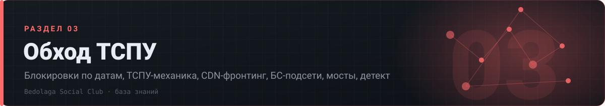

# 🛡 03 · Обход ТСПУ

> Блокировки по датам, ТСПУ-механика, CDN-фронтинг, БС-подсети, мосты, детект

[⌂ База знаний](../../README.md) · [🗺 Карта](../../MAP.md) · Индексы: [релизы](../../indexes/релизы.md) · [ошибки](../../indexes/ошибки.md) · [env](../../indexes/env.md) · [термины](../../indexes/термины.md) · [ссылки](../../indexes/ссылки.md)

`13 документов` · `501 строк` · `335 пруфов` · `14 блоков кода`

---

## Документы раздела

| # | Документ | О чём | Строк | Пруфов |
|---|---|---|---:|---:|
| 1 | **[Хронология блокировок](хронология.md)** | что отвалилось и когда — год по датам | 85 | 75 |
| 2 | **[Работающие методы](методы-обхода.md)** | устойчивые схемы, новинки 2026, finalmask (SSH/DNS/XMC) | 28 | 25 |
| 3 | **[CDN-фронтинг](cdn-фронтинг.md)** | Yandex, Beeline/CDNVideo, VK, Selectel, MWS — с конфигами | 83 | 43 |
| 4 | **[БС (белые списки)](бс-подсети.md)** | механика белых подсетей, кто их даёт, как проверять | 51 | 26 |
| 5 | **[Мосты RU→EU](мосты.md)** | каскады, пары «вход в РФ → выход в ЕС» | 20 | 17 |
| 6 | **[WARP и Cloudflare](warp.md)** | wgcf, NaiveProxy, когда помогает | 24 | 12 |
| 7 | **[Детект и fingerprint](детект-fingerprint.md)** | uTLS, TLS-in-TLS, отпечатки по датам | 50 | 43 |
| 8 | **[DNS-трюки](dns.md)** | DoH/DoT, подмены, фильтрация | 9 | 7 |
| 9 | **[Чекеры ТСПУ/БС](чекеры.md)** | инструменты проверки блокировок и подсетей | 29 | 25 |
| 10 | **[Релизы как вехи](релизы-вехи.md)** | Remnawave 3.0, утечка сабпейджа и прочие переломы | 57 | 9 |
| 11 | **[Экономика обхода](экономика.md)** | сколько стоит держать схему живой | 43 | 36 |
| 12 | **[Правовое](правовое.md)** | что происходило в законах и практике | 13 | 10 |
| 13 | **[Итог на 23.08.2026](итоги.md)** | состояние обхода на конец архива | 9 | 7 |

---

## Что внутри документов

<b>Хронология блокировок</b> — 3 разделов

- [Хронология блокировок и вехи (с датами) · Часть A](хронология.md#хронология-блокировок-и-вехи-с-датами--часть-a)
- [Хронология вех (продолжение) · Часть B](хронология.md#хронология-вех-продолжение--часть-b)
- [События (12.08-23.08.2026) · Часть B](хронология.md#события-1208-23082026--часть-b)

<b>Работающие методы</b> — 3 разделов

- [Устойчивые методы (селфстил, обфускация, SNI) · Часть A](методы-обхода.md#устойчивые-методы-селфстил-обфускация-sni--часть-a)
- [Обходы (новое 06.2026+) · Часть B](методы-обхода.md#обходы-новое-062026--часть-b)
- [Finalmask-транспорты (SSH/DNS/Minecraft/XMC) — август 2026 · Часть B](методы-обхода.md#finalmask-транспорты-sshdnsminecraftxmc--август-2026--часть-b)

<b>CDN-фронтинг</b> — 2 разделов

- [CDN-фронтинг (Yandex / Beeline / VK / Selectel / MWS) · Часть A](cdn-фронтинг.md#cdn-фронтинг-yandex--beeline--vk--selectel--mws--часть-a)
- [CDN-фронтинг по операторам (конкретика) · Часть B](cdn-фронтинг.md#cdn-фронтинг-по-операторам-конкретика--часть-b)

<b>БС (белые списки)</b> — 3 разделов

- [БС (белые списки) — механика и подсети · Часть A](бс-подсети.md#бс-белые-списки--механика-и-подсети--часть-a)
- [БС-механика (обновление 06.2026 — 08.2026) · Часть B](бс-подсети.md#бс-механика-обновление-062026--082026--часть-b)
- [Селектел / подсети на продажу (рынок 07-08.2026) · Часть B](бс-подсети.md#селектел--подсети-на-продажу-рынок-07-082026--часть-b)

<b>Мосты RU→EU</b> — 2 разделов

- [Мосты (ru→eu) и каскады · Часть A](мосты.md#мосты-rueu-и-каскады--часть-a)
- [Мосты ru→eu (продолжение) · Часть B](мосты.md#мосты-rueu-продолжение--часть-b)

<b>WARP и Cloudflare</b> — 2 разделов

- [WARP / Cloudflare / NaiveProxy · Часть A](warp.md#warp--cloudflare--naiveproxy--часть-a)
- [WARP (продолжение) · Часть B](warp.md#warp-продолжение--часть-b)

<b>Детект и fingerprint</b> — 2 разделов

- [Детект uTLS / fingerprint / TLS-in-TLS · Часть A](детект-fingerprint.md#детект-utls--fingerprint--tls-in-tls--часть-a)
- [Детект uTLS / fingerprint / TLS-in-TLS (обновление 06.2026+) · Часть B](детект-fingerprint.md#детект-utls--fingerprint--tls-in-tls-обновление-062026--часть-b)

<b>DNS-трюки</b> — 1 разделов

- [DNS-трюки · Часть A](dns.md#dns-трюки--часть-a)

<b>Чекеры ТСПУ/БС</b> — 2 разделов

- [Инструменты и ссылки · Часть A](чекеры.md#инструменты-и-ссылки--часть-a)
- [Чекеры ТСПУ/БС (обновление) · Часть B](чекеры.md#чекеры-тспубс-обновление--часть-b)

<b>Релизы как вехи</b> — 4 разделов

- [Утечка уязвимости сабпейджа Remnawave (20–22.06.2026) · Часть A](релизы-вехи.md#утечка-уязвимости-сабпейджа-remnawave-2022062026--часть-a)
- [Remnawave / Bedolaga релизы 2025 — 2026 (вехи) · Часть A](релизы-вехи.md#remnawave--bedolaga-релизы-2025--2026-вехи--часть-a)
- [Remnawave / Bedolaga релизы 06.2026-08.2026 · Часть B](релизы-вехи.md#remnawave--bedolaga-релизы-062026-082026--часть-b)
- [Remnawave 3.0 (Breaking change) · Часть B](релизы-вехи.md#remnawave-30-breaking-change--часть-b)

<b>Экономика обхода</b> — 4 разделов

- [Экономика (комиссии платёжек, цены хостеров) · Часть A](экономика.md#экономика-комиссии-платёжек-цены-хостеров--часть-a)
- [Хостинг: цены и опыт (обобщение по заметкам 087-172) · Часть B](экономика.md#хостинг-цены-и-опыт-обобщение-по-заметкам-087-172--часть-b)
- [Платёжки (комиссии/выводы 06-08.2026) · Часть B](экономика.md#платёжки-комиссиивыводы-06-082026--часть-b)
- [Рынок услуг (август 2026) · Часть B](экономика.md#рынок-услуг-август-2026--часть-b)

<b>Правовое</b> — 2 разделов

- [Правовое · Часть A](правовое.md#правовое--часть-a)
- [Правовое (06-08.2026) · Часть B](правовое.md#правовое-06-082026--часть-b)

<b>Итог на 23.08.2026</b> — 1 разделов

- [Состояние обхода на 23.08.2026 (итог) · Часть B](итоги.md#состояние-обхода-на-23082026-итог--часть-b)

---

◀ [🔌 02. Транспорты](../02-транспорты/README.md) · [🖧 04. Сеть и серверы](../04-сеть-серверы/README.md) ▶

[⌂ База знаний](../../README.md) · [🗺 Карта](../../MAP.md) · Индексы: [релизы](../../indexes/релизы.md) · [ошибки](../../indexes/ошибки.md) · [env](../../indexes/env.md) · [термины](../../indexes/термины.md) · [ссылки](../../indexes/ссылки.md)
