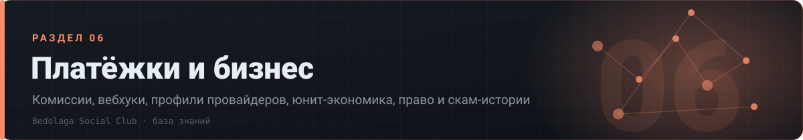

# 💳 06 · Платёжки и бизнес

> Комиссии, вебхуки, профили провайдеров, юнит-экономика, право и скам-истории

[⌂ База знаний](../../README.md) · [🗺 Карта](../../MAP.md) · Индексы: [релизы](../../indexes/релизы.md) · [ошибки](../../indexes/ошибки.md) · [env](../../indexes/env.md) · [термины](../../indexes/термины.md) · [ссылки](../../indexes/ссылки.md)

`11 документов` · `400 строк` · `539 пруфов` · `5 блоков кода`

---

## Документы раздела

| # | Документ | О чём | Строк | Пруфов |
|---|---|---|---:|---:|
| 1 | **[Комиссии](комиссии.md)** | сводная таблица по всем платёжкам | 25 | 46 |
| 2 | **[Профили платёжек](профили-платёжек.md)** | ЮKassa, Platega, Lava, RollyPay, WATA, cisPay и др. | 114 | 218 |
| 3 | **[Env и вебхуки](env-вебхуки.md)** | дословные конфиги подключения и грабли | 57 | 16 |
| 4 | **[ЮKassa и легальные кассы](юкасса.md)** | что требует, чем рискуешь | 20 | 18 |
| 5 | **[Юнит-экономика](юнит-экономика.md)** | цены подписок, конверсия, реклама, рефералка | 37 | 41 |
| 6 | **[Экономика хостинга](экономика-хостинга.md)** | мульти-IP, подсети, серверы — прайсы рынка | 42 | 66 |
| 7 | **[CDN и биллинг](cdn-биллинг.md)** | тарификация CDN, антифрод, оверселл | 16 | 19 |
| 8 | **[Риски и скам](риски-скам.md)** | кто кинул, как не попасть | 12 | 18 |
| 9 | **[Право РФ](право-рф.md)** | ФЗ, штрафы, аресты, OpSec-план | 42 | 53 |
| 10 | **[Вехи](вехи.md)** | события экономики и платёжек по датам | 24 | 24 |
| 11 | **[Тезисы для выживания](тезисы.md)** | короткий свод главного | 11 | 20 |

---

## Что внутри документов

<b>Профили платёжек</b> — 22 разделов

- [ЮKassa (легальная)](профили-платёжек.md#юkassa-легальная)
- [Platega (серая)](профили-платёжек.md#platega-серая)
- [Lava (серая; lava.ru/lava.gg, позже lava.top, переезд в qplus)](профили-платёжек.md#lava-серая-lavarulavagg-позже-lavatop-переезд-в-qplus)
- [RollyPay (серая)](профили-платёжек.md#rollypay-серая)
- [cisPay (серая, ~2 месяца на рынке на 21.08.2026)](профили-платёжек.md#cispay-серая-2-месяца-на-рынке-на-21082026)
- [WATA (вата)](профили-платёжек.md#wata-вата)
- [Палыч (Pal24/PayPalych)](профили-платёжек.md#палыч-pal24paypalych)
- [Palli](профили-платёжек.md#palli)
- [AntiLopay (Антилопа)](профили-платёжек.md#antilopay-антилопа)
- [Heleket](профили-платёжек.md#heleket)
- [2328.io (крипта)](профили-платёжек.md#2328io-крипта)
- [ГойПей / Пейформа (микро-процессинг)](профили-платёжек.md#гойпей--пейформа-микро-процессинг)
- [Anore](профили-платёжек.md#anore)
- [Overpay](профили-платёжек.md#overpay)
- [AuroPay (бывшая Aura)](профили-платёжек.md#auropay-бывшая-aura)
- [RapiraPay](профили-платёжек.md#rapirapay)
- [ParityPay](профили-платёжек.md#paritypay)
- [CloudPayments](профили-платёжек.md#cloudpayments)
- [Крипто-инфраструктура](профили-платёжек.md#крипто-инфраструктура)
- [Электронные карты](профили-платёжек.md#электронные-карты)
- [Название платёжки — комплаенс](профили-платёжек.md#название-платёжки--комплаенс)
- [Идеальная платёжка (мем-дискуссия, но полезная)](профили-платёжек.md#идеальная-платёжка-мем-дискуссия-но-полезная)

<b>Env и вебхуки</b> — 8 разделов

- [Общий запуск бота (08.11.2025)](env-вебхуки.md#общий-запуск-бота-08112025)
- [Platega](env-вебхуки.md#platega)
- [CryptoBot (v2.2.5, [id=4757](https://t.me/c/2941121338/4757), 09.09.2025)](env-вебхуки.md#cryptobot-v225-id4757-09092025)
- [Проверка/отмена платежей](env-вебхуки.md#проверкаотмена-платежей)
- [Ценообразование трафика (v2.0.5, [id=75](https://t.me/c/2941121338/2/75))](env-вебхуки.md#ценообразование-трафика-v205-id75)
- [Пути вебхуков (Caddy/Nginx reverse-proxy)](env-вебхуки.md#пути-вебхуков-caddynginx-reverse-proxy)
- [Грабли вебхуков](env-вебхуки.md#грабли-вебхуков)
- [Вывод средств (bedolaga-cabinet)](env-вебхуки.md#вывод-средств-bedolaga-cabinet)

<b>ЮKassa и легальные кассы</b> — 3 разделов

- [Bedolaga: feature-запросы по платёжкам](юкасса.md#bedolaga-feature-запросы-по-платёжкам)
- [Проблема баланса и подписки (баги-кейсы)](юкасса.md#проблема-баланса-и-подписки-баги-кейсы)
- [Bedolaga: webhooks и очереди](юкасса.md#bedolaga-webhooks-и-очереди)

<b>Юнит-экономика</b> — 4 разделов

- [Конверсия и рынок](юнит-экономика.md#конверсия-и-рынок)
- [Реклама и маркетинг (экономика)](юнит-экономика.md#реклама-и-маркетинг-экономика)
- [Продажа проектов и мануалов (рынок)](юнит-экономика.md#продажа-проектов-и-мануалов-рынок)
- [Реферальные схемы](юнит-экономика.md#реферальные-схемы)

<b>Экономика хостинга</b> — 4 разделов

- [Мульти-IP и подсети (типовые прайсы рынка)](экономика-хостинга.md#мульти-ip-и-подсети-типовые-прайсы-рынка)
- [Хостинг-экономика (примеры)](экономика-хостинга.md#хостинг-экономика-примеры)
- [Аренда/продажа серверов по каналам (типовое)](экономика-хостинга.md#арендапродажа-серверов-по-каналам-типовое)
- [Спидтесты и производительность (экономика качества)](экономика-хостинга.md#спидтесты-и-производительность-экономика-качества)

<b>CDN и биллинг</b> — 3 разделов

- [Тарификация CDN (тарифы)](cdn-биллинг.md#тарификация-cdn-тарифы)
- [Антифрод Яндекса (гранты)](cdn-биллинг.md#антифрод-яндекса-гранты)
- [Оверселл/шейпинг (экономика качества)](cdn-биллинг.md#оверселлшейпинг-экономика-качества)

<b>Право РФ</b> — 5 разделов

- [Нормативная база](право-рф.md#нормативная-база)
- [OpSec-план «как выжить» (徹夜 高橋, 27.07)](право-рф.md#opsec-план-как-выжить-徹夜-高橋-2707)
- [Цифровой рубль и 115-ФЗ (риски)](право-рф.md#цифровой-рубль-и-115-фз-риски)
- [Правовой статус платёжек](право-рф.md#правовой-статус-платёжек)
- [Аресты/уголовка (факты)](право-рф.md#арестыуголовка-факты)

<b>Вехи</b> — 3 разделов

- [2025](вехи.md#2025)
- [2026](вехи.md#2026)
- [Вехи правового статуса](вехи.md#вехи-правового-статуса)

---

◀ [🌍 05. Хостинги](../05-хостинги/README.md) · [⚙ 07. Скрипты и API](../07-скрипты/README.md) ▶

[⌂ База знаний](../../README.md) · [🗺 Карта](../../MAP.md) · Индексы: [релизы](../../indexes/релизы.md) · [ошибки](../../indexes/ошибки.md) · [env](../../indexes/env.md) · [термины](../../indexes/термины.md) · [ссылки](../../indexes/ссылки.md)
