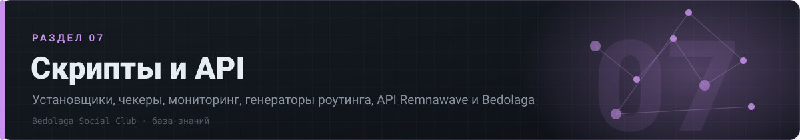

# ⚙ 07 · Скрипты и API

> Установщики, чекеры, мониторинг, генераторы роутинга, API Remnawave и Bedolaga

[⌂ База знаний](../../README.md) · [🗺 Карта](../../MAP.md) · Индексы: [релизы](../../indexes/релизы.md) · [ошибки](../../indexes/ошибки.md) · [env](../../indexes/env.md) · [термины](../../indexes/термины.md) · [ссылки](../../indexes/ссылки.md)

`14 документов` · `437 строк` · `266 пруфов` · `15 блоков кода`

---

## Документы раздела

| # | Документ | О чём | Строк | Пруфов |
|---|---|---|---:|---:|
| 1 | **[Экосистема](экосистема.md)** | официальные репозитории и проекты из закрепа | 16 | 15 |
| 2 | **[Установщики](установщики.md)** | скрипты установки бота, панели, нод | 76 | 24 |
| 3 | **[API](api.md)** | WebAPI бота, 30 вебхуков Remnawave, bulk-операции | 82 | 30 |
| 4 | **[Чекеры и бенчмарки](чекеры.md)** | censorcheck, YABS, iperf, ipregion, sysbench | 55 | 26 |
| 5 | **[Мониторинг](мониторинг.md)** | скрипты слежения за нодами и трафиком | 16 | 15 |
| 6 | **[Решала и защита](решала-защита.md)** | Reshala, Traffic Guard, брандмауэры | 51 | 48 |
| 7 | **[Генераторы роутинга](роутинг-генераторы.md)** | geo-правила, списки, автогенерация | 24 | 27 |
| 8 | **[WARP / Psiphon](warp-psiphon.md)** | скрипты поднятия и связки | 21 | 10 |
| 9 | **[Боты-помощники](боты-помощники.md)** | самописные боты сообщества | 42 | 33 |
| 10 | **[MTProto](mtproto.md)** | telemt: панель и скрипты | 10 | 9 |
| 11 | **[Налоги и чеки](налоги.md)** | НалоGO, самозанятость, чеки | 7 | 6 |
| 12 | **[Генерация секретов](секреты.md)** | ключи, токены, пароли — как правильно | 7 | 1 |
| 13 | **[Ошибки → фиксы](ошибки-фиксы.md)** | самое частое по скриптам | 22 | 20 |
| 14 | **[Итог на 23.08.2026](итоги.md)** | состояние инструментов на конец архива | 8 | 2 |

---

## Что внутри документов

<b>Установщики</b> — 2 разделов

- [2.1 Установщики Bedolaga](установщики.md#21-установщики-bedolaga)
- [2.2 Установщики нод](установщики.md#22-установщики-нод)

<b>API</b> — 5 разделов

- [11.1 WebAPI бота (порт 8080)](api.md#111-webapi-бота-порт-8080)
- [11.2 Webhooks Remnawave → Bedolaga (30 событий, v3.10.0, 10.02.2026)](api.md#112-webhooks-remnawave--bedolaga-30-событий-v3100-10022026)
- [11.3 Единый webhook-сервер Bedolaga (v2.6.0, 07.11.2025)](api.md#113-единый-webhook-сервер-bedolaga-v260-07112025)
- [11.4 Bulk-операции через Remnawave REST API](api.md#114-bulk-операции-через-remnawave-rest-api)
- [11.5 Патчи/PR, на которые ссылаются](api.md#115-патчиpr-на-которые-ссылаются)

<b>Решала и защита</b> — 2 разделов

- [3.1 Reshala-Remnawave-Bedolaga](решала-защита.md#31-reshala-remnawave-bedolaga)
- [3.2 Traffic Guard и брандмауэры](решала-защита.md#32-traffic-guard-и-брандмауэры)

---

◀ [💳 06. Платёжки и бизнес](../06-платёжки/README.md) · [🗓 08. Хронология](../08-хронология/README.md) ▶

[⌂ База знаний](../../README.md) · [🗺 Карта](../../MAP.md) · Индексы: [релизы](../../indexes/релизы.md) · [ошибки](../../indexes/ошибки.md) · [env](../../indexes/env.md) · [термины](../../indexes/термины.md) · [ссылки](../../indexes/ссылки.md)
