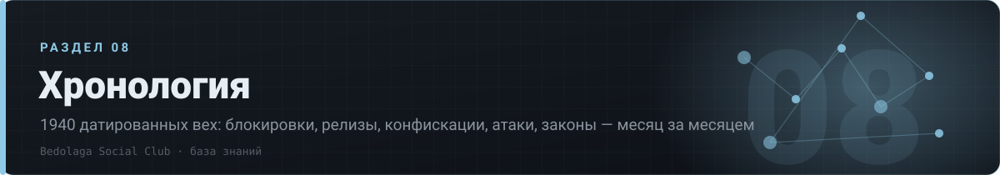

# 🗓 08 · Хронология

> 1940 датированных вех: блокировки, релизы, конфискации, атаки, законы — месяц за месяцем

[⌂ База знаний](../../README.md) · [🗺 Карта](../../MAP.md) · Индексы: [релизы](../../indexes/релизы.md) · [ошибки](../../indexes/ошибки.md) · [env](../../indexes/env.md) · [термины](../../indexes/термины.md) · [ссылки](../../indexes/ссылки.md)

`16 документов` · `1956 строк` · `2234 пруфов` · `0 блоков кода`

---

## Документы раздела

| # | Документ | О чём | Строк | Пруфов |
|---|---|---|---:|---:|
| 1 | **[Март 2024](2024-03.md)** | датированных вех: 1 | 2 | 1 |
| 2 | **[Январь 2025](2025-01.md)** | датированных вех: 1 | 2 | 1 |
| 3 | **[Апрель 2025](2025-04.md)** | датированных вех: 1 | 2 | 1 |
| 4 | **[Август 2025](2025-08.md)** | датированных вех: 77 | 78 | 77 |
| 5 | **[Сентябрь 2025](2025-09.md)** | датированных вех: 53 | 54 | 53 |
| 6 | **[Октябрь 2025](2025-10.md)** | датированных вех: 46 | 47 | 46 |
| 7 | **[Ноябрь 2025](2025-11.md)** | датированных вех: 58 | 59 | 60 |
| 8 | **[Декабрь 2025](2025-12.md)** | датированных вех: 64 | 65 | 65 |
| 9 | **[Январь 2026](2026-01.md)** | датированных вех: 81 | 82 | 81 |
| 10 | **[Февраль 2026](2026-02.md)** | датированных вех: 112 | 113 | 112 |
| 11 | **[Март 2026](2026-03.md)** | датированных вех: 93 | 94 | 93 |
| 12 | **[Апрель 2026](2026-04.md)** | датированных вех: 109 | 110 | 116 |
| 13 | **[Май 2026](2026-05.md)** | датированных вех: 296 | 297 | 348 |
| 14 | **[Июнь 2026](2026-06.md)** | датированных вех: 384 | 385 | 471 |
| 15 | **[Июль 2026](2026-07.md)** | датированных вех: 233 | 234 | 320 |
| 16 | **[Август 2026](2026-08.md)** | датированных вех: 331 | 332 | 389 |
---

◀ [⚙ 07. Скрипты и API](../07-скрипты/README.md)

[⌂ База знаний](../../README.md) · [🗺 Карта](../../MAP.md) · Индексы: [релизы](../../indexes/релизы.md) · [ошибки](../../indexes/ошибки.md) · [env](../../indexes/env.md) · [термины](../../indexes/термины.md) · [ссылки](../../indexes/ссылки.md)
